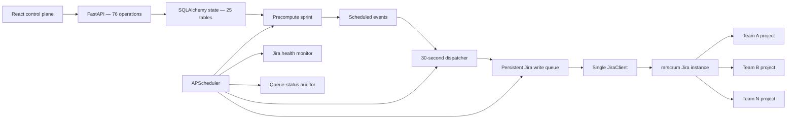

# Jira Team Simulator — Requirements and Functionality Map

Assessment date: 2026-08-10

Code baseline: `main` at `b65b133`

Planning update: the product decisions listed as unresolved in this point-in-time assessment were
resolved later on 2026-08-10. The approved future contract begins at
[`docs/v2/README.md`](v2/README.md). This document remains authoritative evidence of the assessed
code state; it is not the v2 implementation specification.

Scope: repository code, tests, configuration, infrastructure, and documentation. The live
`mrscrum` Jira instance and EC2 deployment were not accessed or modified.

## 1. Executive Assessment

The repository contains a substantial control plane and simulation prototype:

- one globally configured Jira Cloud connection;
- multiple teams, each mapped to a unique Jira project key and its own board/configuration;
- React configuration screens for teams, workflows, members, timing templates, move-left
  probabilities, dependencies, simulation controls, and precomputed sprint schedules;
- a distribution-based workflow simulator;
- persistent scheduled events and a persistent Jira write queue;
- Jira project/bootstrap, issue, transition, sprint, health, retry, and audit services;
- AWS/Terraform, Docker Compose, Nginx, and CI/CD assets.

It is not yet safe to classify the north-star workflow as complete. The current implementation
can precompute plausible status-transition schedules and can send queued operations to Jira, but
several gaps prevent reliable, indefinite, real-time synchronization:

1. Precomputed issue outcomes are not applied back to the internal `Issue` records.
2. A newly created local sprint does not have a Jira sprint ID when its schedule is generated,
   so add/start/complete Jira sprint events are normally omitted.
3. Dispatch does not enforce sprint activation, team pause, or team active state.
4. The production Compose stack uses PostgreSQL on a Docker named volume, conflicting with the
   mandated SQLite database on `/data` EBS.
5. Real-Jira integration tests are disabled in the normal test and CI runs.

The appropriate current label is **partially integrated simulation system**, not a completed
real-time faux Jira service.

## 2. Requirements Authority and Product Boundary

This section records the authority state at assessment time. For all v2 implementation after the
approved 2026-08-10 plan, use the precedence and reading order in `docs/v2/README.md`. In particular,
`docs/simulation-engine-rewrite-requirements.md` and `docs/plan/phase-*.md` are historical and must
not drive v2 work.

The current operating contract is:

- Exactly one Jira instance is connected: `mrscrum`.
- Jira credentials and the base URL are global application settings, not team settings.
- Multiple teams exist inside the simulator.
- Each team maps to one distinct Jira project, identified by `jira_project_key`, and can have its
  own Jira board ID.
- Every team/project is configured independently: members, roles, workflow, timing distributions,
  move-left behavior, sprint capacity, working hours, timezone, and backlog target.
- Jira statuses must map 1:1 to configured workflow status names.
- Statistical simulation determines when work moves through those statuses.
- Jira writes go through the persistent write queue; the engine does not call Jira directly.
- Jira's actual assignee and reporter are not changed after issue creation. Virtual ownership is
  represented through internal state and the `sim_assignee`/`sim_reporter` text fields.
- The system is single-tenant and single-Jira-instance. Multi-instance credentials, tenant
  isolation, and per-team Jira accounts are outside the current boundary.

The conflicts that were open during assessment are now resolved for v2:

- production returns to SQLite/WAL on `/data` EBS with one scheduler/application replica;
- teams share canonical statuses and issue types select their own valid routes/timing;
- production uses persisted live ticks; precompute is forecast/test-only;
- simulated Scrum sprints use fixed boundaries and do not finish early; carryover has no automatic
  penalty; and
- the required first risk catalogue is long stay, carryover, synthetic external dependency,
  cancellation, review/QA/PO rejection, and member unavailability, with richer events later.

The same approved plan additionally requires controlled ingestion of manual Jira sprint/card
changes through a durable intervention inbox after the basic Codex alpha.

## 3. Current Runtime Architecture

The startup path creates one `JiraClient`, one health monitor, one write queue, one simulation
engine, one event dispatcher, and one scheduler for the entire application. Team separation is
implemented through `team_id`, project key, board ID, and per-team configuration records.

The effective simulation path is schedule-based:

1. Load a team's backlog, workflow, members, timing, and move-left configuration.
2. Select sprint items using a randomly sampled story-point capacity.
3. Simulate the whole sprint in memory using snapshot dataclasses.
4. Persist timestamped `ScheduledEvent` rows.
5. Dispatch due events into `JiraWriteQueueEntry` rows.
6. Process the queue against Jira with pacing and rate-limit handling.

The older `SimulationEngine.tick()` remains, but it now manages sprint lifecycle and backlog
maintenance rather than advancing each issue live.

## 4. Requirements-to-Functionality Map

Status legend:

- **Implemented** — code path exists and local tests cover its core behavior.
- **Partial** — material behavior exists, but acceptance criteria or integration are incomplete.
- **Data/UI only** — configuration can be stored or displayed but has no simulation effect.
- **Missing** — required behavior was not found.
- **Conflict** — implementation contradicts a current project constraint.

| Area | Required behavior | Current implementation | Status |
|---|---|---|---|
| Jira instance | One global `mrscrum` connection | One `Settings` credential set and one startup `JiraClient` | Implemented |
| Team/project mapping | One Jira project per team | Unique `Team.jira_project_key`; per-team `jira_board_id` | Implemented |
| Team isolation | Each project configured separately | Team-scoped members, workflow, timing, move-left, sprints, issues, schedules | Partial |
| Organization | Host multiple teams | One auto-created default organization; no organization UI/API | Implemented for single organization |
| Team management | Create, edit, deactivate teams | Backend CRUD and frontend team switcher/modal/settings | Partial |
| Members and roles | Per-team virtual members and capacity | Member CRUD; roles are free-text; capacity fields exist | Partial |
| Workflow | Jira-mirrored ordered statuses per project/item type | One ordered workflow per team, shared by every issue type | Partial |
| Timing model | Per status/type/size full-time and work-time distributions | p25/p50/p99 log-normal full time plus uniform min/max work time | Implemented |
| Timing templates | Reusable timing baselines | Global template CRUD, preview, visualizations, application to teams | Implemented |
| Move-left | Type-aware probability grid and timer reset | Team/type/size config; weighted regression; timers re-sampled on entry | Implemented with validation gaps |
| Capacity | One eligible member/item/tick and sticky assignment | Role matching and per-tick states exist; precompute rebuild loses sticky ownership | Partial |
| Working calendar | Team timezone, hours, weekdays, holidays | Weekday/timezone/holiday tick schedule exists | Partial |
| Backlog | Maintain depth and create Jira items | Tick creates at most five template-generated issues and queues Jira creation | Partial |
| Sprint planning | Random target in team min/max; priority/carryover ordering | Implemented in `plan_sprint()` and precompute | Implemented |
| Sprint execution | Advance items statistically over working ticks | Whole sprint is simulated in memory and converted into scheduled events | Partial |
| Continuous operation | Automatically run across sprints until stopped | Lifecycle/cadence components exist; restart and state synchronization are incomplete | Partial |
| Jira transitions | Send 1:1 status changes at modeled times | Transition events resolve a target status name to an available Jira transition | Partial |
| Jira sprint lifecycle | Create, fill, start, and complete sprints | Queue operations exist, but newly precomputed sprints normally omit fill/start/complete | Partial |
| Virtual assignee/reporter | Track handoffs without changing actual Jira assignee/reporter | Fields are created; runtime backlog sets `sim_reporter`; engine does not update `sim_assignee` | Partial |
| Jira comments | Worker-style comments for relevant events | Client/queue support comments; current simulation emits essentially none | Missing from active simulation |
| Batched writes | No mid-simulation direct Jira writes | Simulation produces actions/events and queue performs external writes | Implemented |
| Offline handling | Persist writes, recover, and catch up safely | Queue persists and pauses when OFFLINE; recovery is not wired to completion | Partial |
| Cross-team dependencies | Mechanical cross-project effects | Dependency CRUD and UI only; no workflow/schedule effects | Data/UI only |
| Dysfunctions | Mechanical timing/capacity/scope effects | Models/schemas remain, but no active router, UI, or engine handlers | Missing |
| Audit | Verify expected Jira activity | Audits queue completion, not Jira state; alert sending is not completed | Partial |
| Dashboard | Observe simulated flow and event health | Schedule, item events, flow matrix, diagnostics, and audit views | Partial |
| Persistence | Survive restarts on `/data` EBS SQLite | Scheduled events/queue are persistent, but Compose forces PostgreSQL elsewhere | Conflict |
| Security | Safely operate public control plane | No application authentication; HTTP-only Nginx; destructive endpoints are exposed | Missing/hardening required |
| Automated verification | Unit, UI, lint, build, real Jira E2E | Local suite is green; real Jira suite is skipped by default and in CI | Partial |

## 5. Configuration Ownership Map

### Global application configuration

- `JIRA_BASE_URL`, `JIRA_EMAIL`, `JIRA_API_TOKEN`
- `OPENAI_API_KEY`
- database URL and runtime logging settings
- Jira custom-field IDs stored in the global `jira_config` table
- one scheduler, Jira health state, queue processor, and event dispatcher

This correctly represents the single connected Jira instance.

### Per-team/project configuration

- identity: name, Jira project key, Jira board ID, active/bootstrap state;
- sprint: duration, capacity range, priority randomization, planning strategy;
- working calendar: start/end hour, timezone, holidays;
- simulation: tick duration and backlog target;
- virtual members: name, role, nominal daily capacity, WIP limit, active state;
- one workflow containing ordered Jira statuses;
- per-step acceptable roles and status category;
- timing for each `(workflow step, issue type, story points)` tuple;
- move-left probability/targets by step, issue type, and optionally story points;
- sprints, issues, scheduled events, audit logs, and queue entries.

### Global reusable configuration

- timing templates and their issue-type/story-point entries;
- the single Jira custom-field registry.

### Stored but not operational

- `DysfunctionConfig` probability and multiplier fields;
- `CrossTeamDependency` relationships;
- `SimulationEventConfig` and `SimulationEventLog`;
- `DailyCapacityLog` writes;
- `JiraIssueMap` and `JiraIssueLink` in the active queue path.

## 6. Simulation Model Map

### Implemented statistical behavior

- Full time in a status is sampled once from a fitted log-normal distribution using p25, p50,
  and p99.
- Work time is sampled once from a uniform `[min_hours, max_hours]` range.
- An item transitions only after full time has elapsed and work time is complete.
- Zero-work statuses consume no member capacity.
- Sprint capacity is sampled uniformly from a configured story-point range.
- Backlog selection prioritizes carryover and backlog rank, or shuffles when configured.
- Move-left rolls can return an item to a weighted earlier status and re-sample timers.
- The calendar skips weekends and configured holidays and uses team working hours/timezone.
- A deterministic RNG seed can reproduce a precomputed sprint.

### Material model deviations

- There is one workflow per team, not a distinct status sequence per issue type.
- Waiting items are processed in list order rather than randomly competing for a role.
- Precompute recreates members each tick with no sticky assignment metadata. An issue that already
  has `current_worker_id` can continue even when that member was marked busy by another issue in
  the same tick.
- `daily_capacity_hours` and `max_concurrent_wip` are not used by the active precompute algorithm.
- The default working window is eight hours while the stated default member capacity is six hours.
- The legacy wait-time, touch-time-remaining, WIP contribution, and max-wait fields are not used by
  the active distribution engine.
- The precompute loop can complete a sprint early when every item finishes, rather than waiting
  for the configured sprint boundary.
- Precomputed final issue states are returned in memory but discarded by the persistence layer.

## 7. Jira Synchronization Map

### Implemented queue operations

- `CREATE_SPRINT`
- `CREATE_ISSUE`
- `ADD_TO_SPRINT`
- `MOVE_TO_BACKLOG`
- `TRANSITION_ISSUE`
- `ADD_COMMENT`
- `CREATE_LINK`
- `UPDATE_ISSUE`
- `UPDATE_SPRINT_DETAILS`
- `UPDATE_SPRINT` (start)
- `COMPLETE_SPRINT`
- `DELETE_SPRINT`

The queue is persisted, prioritized, paced to at least 0.2 seconds between writes, and returns a
rate-limited entry to `PENDING` using Jira's `Retry-After` value.

### Blocking synchronization gaps

1. **Local/Jira issue state divergence.** Dispatching a transition changes Jira but does not update
   the local issue's status, workflow step, timers, worker, or completion timestamp. A completed
   sprint can therefore treat every local issue as carryover.
2. **New Jira sprint ID is unavailable during precompute.** The precompute emits `CREATE_SPRINT`,
   but conditions `ADD_TO_SPRINT`, start, and complete events on an already known
   `jira_sprint_id`. The queue maps the new ID later, after those events would have been created.
3. **Activation is advisory only.** The dispatcher selects all due `PENDING`/`MODIFIED` events and
   does not check whether the sprint is `ACTIVE`.
4. **Team controls do not govern dispatch.** Pausing or deactivating a team does not stop that
   team's already scheduled events from dispatching.
5. **First-status transition can be invalid.** Planning emits a transition to the first workflow
   status even when a newly created Jira issue already starts in that status; Jira may offer no
   transition to the current status.
6. **Virtual ownership is incomplete.** Member selection is internal to the precomputed snapshot,
   but no `UPDATE_ISSUE` event writes the selected member to `sim_assignee`.
7. **Sprint edit/delete uses the wrong app-state attribute.** Jira-synchronized sprint edit/delete
   paths request `app.state.jira_write_queue`, while startup registers `app.state.write_queue`.
8. **Recovery does not complete.** Health moves from OFFLINE to RECOVERING, but startup does not
   call queue recovery or `mark_recovery_complete()`. The recovered alert condition is unreachable.
9. **Audit confirms queue status, not Jira state.** `DONE` means the Jira client call returned
   successfully; the auditor does not read Jira back to verify the final project state.

## 8. Runtime Control Map

- On backend startup, simulation tick, queue processing, and event dispatch jobs are created in a
  paused state.
- `POST /simulation/start` starts the engine and resumes all three jobs globally.
- Global pause/reset pauses all three jobs.
- Per-team pause only excludes the team from lifecycle ticks; it does not filter event dispatch.
- Per-team start/resume does not start the global engine or resume scheduler jobs.
- Sprint activation changes a database phase but does not start/resume the dispatcher.
- Engine state, paused-team IDs, clock speed, and tick count are in memory and reset on restart.
- Persisted schedules and queue entries survive a process restart, but will not resume until the
  global start endpoint is called.
- The API's tick-interval update changes an engine attribute, not the scheduler's fixed 60-second
  interval.
- SimClock speed does not scale precomputed `scheduled_at` timestamps, so the advertised
  one-minute-to-one-hour verification mode does not accelerate the active schedule path.

## 9. Frontend Functionality Map

The React application currently exposes these sections:

- Workflow: Jira statuses, roles, status categories, timing grids/tree, and move-left settings.
- Members: add/edit/delete virtual team members.
- Settings: sprint length/capacity, priority randomization, working hours, timezone, tick duration.
- Templates: timing-template CRUD, cycle-time box plot, preview, and application to teams.
- Dependencies: cross-team relationship CRUD.
- Simulation: global start/pause/reset/manual tick, tick interval, and clock speed.
- Schedule: create/edit/delete/precompute/recompute/activate sprints; inspect events, issue flow,
  flow matrix, diagnostics, and audit status.

Not exposed in the normal UI:

- Jira bootstrap/status and queue health/retry/process controls;
- dysfunction configuration;
- first sprint start date, holidays, or sprint cadence configuration;
- per-team simulation pause/resume;
- backlog persistence/generation controls;
- application authentication or authorization.

Frontend automated coverage is minimal: two tests in one test file, despite the breadth of the UI.

## 10. Persistence and Deployment Map

### Required

- Python 3.12, FastAPI, SQLAlchemy/Alembic, React/Vite, APScheduler, and Jira via `httpx`.
- SQLite at `/data/simulator.db` on the encrypted EBS volume.
- All simulation and queue state must survive backend restarts.

### Actual

- Terraform creates and mounts the encrypted EBS volume at `/data`.
- `.env.example` points at SQLite `/data/simulator.db`.
- `docker-compose.yml` starts PostgreSQL 16 and overrides `DATABASE_URL` to PostgreSQL.
- PostgreSQL data is stored in the `pg-data` Docker named volume.
- The `/data` EBS directory is not mounted into the production backend or database container.
- The backend runs Alembic, but its entrypoint can continue after migration failure and startup
  also calls `Base.metadata.create_all()`.
- Nginx maps host port 443 but has no TLS listener/certificate configuration.

The deployment therefore contradicts the repository's persistence constraint and documentation.
The actual durability and backup location of production data must be verified before relying on
the service.

## 11. API and Data Surface

The generated OpenAPI schema contains 76 operations across:

- teams, members, workflows, move-left configuration, and dependencies;
- timing templates and application/preview;
- Jira bootstrap, health, project statuses, and write-queue controls;
- global/per-team simulation and clock controls;
- sprint creation, batch creation, precompute, recompute, activation, edit, and delete;
- scheduled event list/detail/modify/cancel/dispatch;
- item event history, flow matrix, diagnostics, and audit summaries;
- E2E setup and diagnostics helpers.

The SQLAlchemy metadata contains 25 tables. Several are historical or currently dormant, so table
presence must not be treated as evidence that a feature is operational.

## 12. Verification Evidence

Local checks run during this assessment:

- Backend: **518 passed, 43 skipped, 15 warnings** in 26.42 seconds.
- Ruff: **all checks passed**.
- Frontend Vitest: **2 passed**.
- Frontend production build: **succeeded**, with a bundle-size warning for a 557 kB JS chunk.

Limitations of that evidence:

- The 43 skipped tests include the real Jira integration suites gated by
  `INTEGRATION_TESTS=true`.
- Normal CI does not enable the real Jira integration suite.
- Backend tests primarily use SQLite, while production Compose forces PostgreSQL.
- No coverage tool is installed, so no statement about line/branch coverage is justified.
- The backend test run emitted 13 un-awaited coroutine warnings from bootstrapper mocks, one
  SQLAlchemy identity warning, and one Starlette/httpx deprecation warning.
- The live `mrscrum` project topology, credentials, statuses, transitions, screens, and currently
  deployed database were not inspected.

## 13. Prioritized Risk Register

### P0 — Blocks confidence in the north-star workflow

1. Persist precomputed issue state or introduce an event reducer so internal state stays aligned
   with dispatched Jira state.
2. Define and implement the Jira sprint-ID handoff so create/add/start/complete work for a newly
   simulated sprint.
3. Enforce activation, team state, and pause boundaries in event dispatch.
4. Resolve the production database decision and ensure the actual persistent volume is backed up.
5. Run a non-destructive, purpose-built end-to-end acceptance test against `mrscrum` before calling
   the simulator operational.

### P1 — Breaks required simulation or recovery semantics

1. Correct member capacity/sticky assignment across precomputed ticks.
2. Make tick duration, scheduler frequency, and acceleration controls describe the same time model.
3. Restore engine/scheduler state safely after restart.
4. Wire Jira OFFLINE → RECOVERING → ONLINE recovery.
5. Write `sim_assignee`/`sim_reporter` and required comments without changing actual Jira
   assignee/reporter.
6. Correct sprint edit/delete queue wiring and validate the initial-status transition behavior.

### P2 — Product completeness and hardening

1. Decide per-team versus per-item-type workflow ownership and align schema/UI/engine.
2. Implement or explicitly de-scope dysfunction and cross-team mechanical effects.
3. Add validation for probabilities, timing percentile order, capacity ranges, workflow references,
   timezones, and minimum tick size.
4. Add UI for bootstrap/health/retry and the remaining team configuration.
5. Add authentication, TLS, authorization, and protection for E2E/destructive endpoints.
6. Expand frontend and integration coverage and reconcile stale project documentation/backlog.

## 14. Safe Operating Guidance for Future Work

- Do not add per-team Jira credentials or a second Jira client unless the user changes the
  single-instance requirement.
- Treat `Team.jira_project_key` as the Jira-project identity and keep every simulation record
  team-scoped.
- Preserve the persistent queue boundary for all Jira writes.
- Never change Jira's actual assignee or reporter after issue creation.
- Do not infer feature completion from a model, schema, frontend panel, or passing unit test alone;
  trace the active startup-to-Jira path.
- Do not build on historical Stage 4 event-handler claims: those modules are no longer present.
- Resolve architecture conflicts through plan approval before implementation, especially database,
  workflow ownership, simulation mode, and dysfunction scope.
- Any future code change must follow the repository's plan approval, backlog, TDD, clean-code, and
  documentation workflow.
