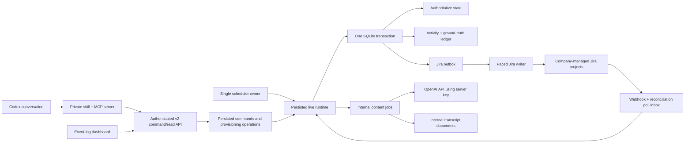
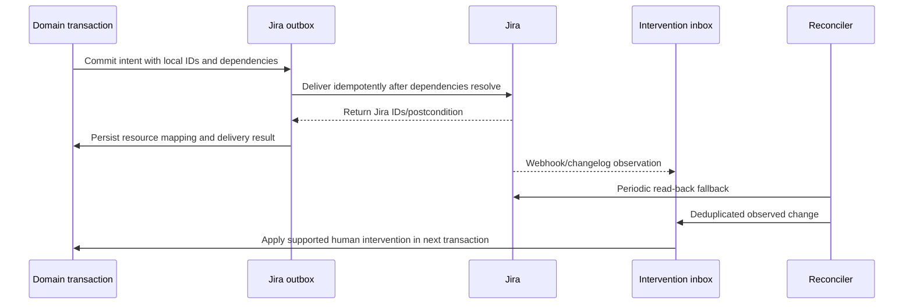

# Jira Team Simulator v2 — High-Level Architecture

> **DETAILED REFERENCE DRAFT.** The active architecture is the shorter version in
> [`high-level-plan.md`](high-level-plan.md); algorithms here are optional implementation notes.

## 1. Architectural Style

V2 is an additive modular monolith. It uses one FastAPI process, one APScheduler owner, one
SQLAlchemy database, and independently testable domain modules. The process may contain separate
async loops for team ticks, Jira inbox reconciliation, Jira outbox delivery, and content jobs, but
they share one unit-of-work boundary and do not form distributed services.



## 2. Source Layout and Isolation

Create new code under explicit v2 boundaries while v1 remains runnable:

```text
backend/app/
├── domain/v2/                 # entities, value objects, invariants, domain events
├── engine/v2/
│   ├── quantiles.py
│   ├── deterministic_rng.py
│   ├── business_calendar.py
│   ├── capacity.py
│   ├── flow.py
│   ├── risks.py
│   ├── runtime.py
│   └── policies/
│       ├── base.py
│       ├── scrum.py
│       └── kanban.py           # added after Scrum sign-off
├── services/v2/               # use cases and transaction orchestration
├── integrations/v2/
│   ├── jira_outbox.py
│   ├── jira_inbox.py
│   ├── jira_reconciler.py
│   ├── jira_provisioner.py
│   └── content_jobs.py
└── api/routers/v2/             # control, reads, events, ground truth, webhook
```

Exact package placement may be adjusted by an approved task-level refactor, but v2 must not reuse
the v1 whole-sprint precompute or memory-only runtime as its production path.

### Reuse matrix

| Existing component | V2 disposition |
|---|---|
| SQLAlchemy base/migrations | Reuse; add migrations only, never rewrite `001`–`012`. |
| SQLite WAL/foreign-key hooks | Reuse and add busy timeout/transaction discipline. |
| Jira HTTP client | Reuse transport/error handling; extend typed operations. |
| Jira write queue | Reuse pacing/retry concepts; introduce a v2 transactional outbox contract. |
| Jira bootstrapper | Reuse capability discovery; build a v2 company-managed provisioner. |
| Business-calendar functions | Fork/reuse tested leaf functions; add dual-clock and DST contracts. |
| Timing template CRUD | Reuse data/import concepts; replace fit/allocation semantics for v2. |
| `distributions.py` | Freeze for v1; replace with exact bounded v2 inverse CDF. |
| `workflow_engine.py` | Reuse behavioral ideas only; v2 operates on persistent status visits. |
| `precompute.py`, `snapshots.py` | Excluded from v2 runtime; forecast/test use only. |
| v1 scheduler/dispatcher | Freeze; v2 scheduler reads persisted runtime and team ownership. |
| React shell/primitives | Reuse selectively; replace primary configuration-first experience. |

## 3. Core Data Ownership

The model is relational state plus an append-only audit/calibration ledger, not full event sourcing.
Recommended additive entities are:

| Entity | Responsibility |
|---|---|
| `TeamBlueprint` | Immutable versioned input used to provision a team. |
| `ProvisioningOperation` | Idempotent asynchronous preview/confirm/provision state. |
| `TeamRuntime` | Runtime version, running/paused state, cursor, next wake, seed, ownership lease. |
| `BusinessCalendar` | Timezone, work interval, weekdays, explicit holidays, version. |
| `ResponsibilityProfile` | Member eligibility and proficiency per activity/status. |
| `MemberAvailability` | Independent time-bounded availability/capacity overlay, source, and reason. |
| `CanonicalStatus` / `IssueRoute` | Shared team statuses and ordered type-specific routes. |
| `TimingBaseline` | Versioned bounded dwell and touch-time configuration. |
| `WorkItem` | Authoritative issue state, origin, Jira mapping, factors, sprint, rank. |
| `StatusVisit` | One entry into a status with samples, progress, queue/touch clocks, worker. |
| `Sprint` | Planned immutable boundary, observed lifecycle, capacity, scope, result. |
| `KanbanPolicy` / `ServiceClock` | WIP, class of service, arrival, SLA/SLE state. |
| `RiskPolicy` / `RiskOccurrence` | Versioned hazard inputs, decision, and mechanical effect. |
| `SyntheticDependency` | Pause/release/resolution state for MVP blockers. |
| `ActivityEvent` | User-facing append-only operational timeline. |
| `GroundTruthEvent` | Machine-oriented immutable calibration record. |
| `JiraOutboxCommand` | Pending/retryable external intent with dependencies/idempotency. |
| `JiraResourceMap` | Local-to-Jira project/board/sprint/issue/status/field identities. |
| `JiraInterventionInbox` | Deduplicated webhook/poll observation of human Jira changes. |
| `AgentCommandAudit` | Actor, scopes, request, confirmation, idempotency, result. |
| `ContentJob` / `TranscriptDocument` | Internal structured/prose generation and provenance. |

Every team-owned table carries `team_id`. Every run-derived record carries `run_id` and, where
applicable, `work_item_id`, `status_visit_id`, `sprint_id`, and deterministic correlation IDs.

## 4. Transaction and Concurrency Model

One successful boundary-bounded live-tick slice or external command is one short database
transaction:

1. Acquire the team's runtime ownership/version check.
2. Load only the state required for the team and interval.
3. Apply eligible Jira interventions, commands, monitors, and boundary actions in the
   `EVENT_TIME_LOOP_V1` precedence below.
4. Advance policy, capacity, flow, and risk between semantic boundaries.
5. Update authoritative rows.
6. Append activity and ground-truth records.
7. Insert Jira outbox intents and internal content jobs.
8. Advance the persisted runtime cursor and any per-decision semantic occurrence sequences.
9. Commit once.

If any step fails, none of the state, evidence, RNG progress, or external intent commits. Network
calls never occur inside this transaction.

SQLite uses WAL, foreign keys, a configured busy timeout, bounded transactions, and one scheduler
writer. APIs may write commands/inbox records concurrently but do not run team transitions inline.
Optimistic runtime version checks prevent a stale worker from committing.

## 5. Time Model

All timestamps are persisted in UTC. Team business calculations use a versioned IANA timezone and
calendar. For each interval the engine can calculate:

- calendar elapsed hours;
- business elapsed hours;
- touch work credited;
- queue business/calendar hours; and
- paused business/calendar hours with reason.

The MVP uses one local daily work interval and explicit full-day holidays. Ambiguous/nonexistent DST
local times are resolved by converting fixed UTC instants through `zoneinfo`, never by attaching a
timezone naively.

In real-time operation, the tick receives a bounded interval ending at the current scheduler wake.
Downtime is identified from the persisted cursor but ordinary work is not credited for it. In
accelerated verification, a simulation clock supplies the same UTC interval interface; production
Jira pacing remains wall-clock based and cannot be accelerated beyond configured rate limits.

### Availability overlays and simulation timers

`AVAILABILITY_OVERLAY_V1` distinguishes the configured availability schedule from runtime
restrictions. Confirmed blueprint/team-settings intervals are ordered and non-overlapping. At an
instant, the active configured interval supplies `configured_fraction` (default 1) and a
`configured_pre_fraction_cap` equal to
`daily_capacity_hours_override ?? member.daily_capacity_hours`. Risk- or command-created runtime
overlays are independent rows and may overlap without colliding with or rewriting that schedule.
Each runtime row has a source, UTC start/end or simulation-duration remainder,
`availability_fraction` in `[0,1]`, an optional `daily_capacity_hours_override` ceiling in `(0,24]`,
and a reason.

Let `effective_fraction` be the minimum of `configured_fraction` and every active runtime fraction.
Let `effective_pre_fraction_cap` be the minimum of `configured_pre_fraction_cap` and every active
non-null runtime capacity ceiling. With no runtime value, the configured value wins. Effective daily
labor capacity is `effective_pre_fraction_cap * effective_fraction`; a runtime overlay can only
restrict, never raise, configured availability. If a newly active restriction lowers the result
below labor already consumed that working date, prior credit remains and remaining allocatable labor
becomes zero. Every contributing schedule/overlay row and the resolved result are recorded.

A natural dependency stores remaining simulation business seconds. A natural absence draw of `N`
whole simulation working days converts at trigger time to
`N * nominal_workday_business_seconds`, where the nominal value is the local wall-clock length of
the team's configured daily work interval. These remainders decrement only by business seconds in
committed running tick slices. Team pause, process downtime, and non-working time decrement zero;
partial processed days decrement the exact credited portion. Absolute intervals instead follow UTC
external truth: after pause or restart, apply only the interval state at the current instant and
never synthesize missed work. Planning uses only overlays committed at its snapshot, projects an
active simulation-duration remainder across future team business time assuming uninterrupted
running, and does not anticipate future stochastic absences.

### Event-time execution inside a tick

`EVENT_TIME_LOOP_V1` advances from the committed cursor toward the wake by the earliest of: a
working-interval/date boundary, sprint boundary, due scheduled command, dependency/availability
timer, aging-warning/long-stay monitor threshold, dwell readiness, or touch completion. It credits
clocks/labor only to that semantic instant, timestamps the resulting event there, releases completed
touch ownership, and reallocates unused labor for the rest of the interval. When dwell and touch are
both ready it may open and advance a new visit in the same tick; zero/short visits may therefore
chain without five-minute quantization.

When elapsed clocks reach a passive p50/p99 monitor at the same instant as a mutation, append the
monitor from the just-credited pre-mutation snapshot first; the monitor changes no mechanics. Then
apply already-accepted Jira observations/control commands, a sprint boundary, scheduled agent
commands, timer resolutions/availability returns, workday-start risk decisions, and finally ordinary
dwell/touch transitions. A sprint boundary or completed business-date close ends a **tick slice** and
is a transaction-splitting commit point: the slice credits pre-boundary work to the old sprint/date,
applies its boundary lifecycle/date close, advances the cursor to that instant, and commits. The new
date's next slice, at its workday-start boundary, applies timer/availability returns, takes and
applies the immutable workday-start risk batch, resets the new-day ledger, and only then credits
ordinary work. Later work belongs to that new slice/transaction.

Defaults `MAX_EVENT_STEPS_PER_SLICE=10000` and `MAX_ITEM_TRANSITIONS_PER_SLICE=100` prevent a
zero-time loop. Counters reset only after a committed boundary slice or at the next scheduler wake.
Exceeding either limit rolls back the current slice and records a visible runtime conflict in a
separate control transaction at the last committed cursor. Earlier slices from the same scheduler
wake remain committed; no state, evidence, RNG occurrence, or intent from the failed slice survives.

## 6. Statistical Baseline

### Exact bounded inverse CDF

Each positive dwell baseline has ordered anchors:

```text
(u=0.00, minimum)
(u=0.25, p25)
(u=0.50, p50)
(u=0.99, p99)
(u=1.00, maximum)
```

For a deterministic uniform draw `u`, interpolate linearly between adjacent anchors in
`log1p(hours)` space and transform with `expm1`. Values at anchor probabilities return the configured
durations within floating-point tolerance, and every sample is bounded. A status whose five anchors
are zero returns zero. Validation rejects negative, non-finite, or unordered anchors.

Touch demand uses `LINEAR_UNIFORM_TOUCH_V1` because it represents active effort, not total status
duration. For finite ordered bounds `a <= b` and explicit `u` in `[0,1]`, return
`a + (b - a) * u`; `u=0` returns `a`, `u=1` returns `b`, and `a=b` returns that bound.
Persist the sampler version, bounds, draw, and result. A later calibrated touch distribution can be
added without changing the `StatusVisit` contract.

### Deterministic substreams

`SEMANTIC_ID_V1` separates replay identity from database primary keys. Its fixed UUIDv5 namespace is
`0f896a61-4777-57d8-9e81-62c5c4ab2b7f`. A semantic RNG UUID is UUIDv5 of that namespace and one
UTF-8 canonical path:

- `team/<canonical-final-blueprint-sha256>`;
- `run/<team-rng-uuid>/<zero-based-run-ordinal>`;
- `member/<team-rng-uuid>/<zero-based-canonical-blueprint-index>`;
- `sprint/<team-rng-uuid>/<zero-based-created-sprint-ordinal>`;
- `item/<team-rng-uuid>/<creation-kind>/<zero-based-kind-sequence>`;
- `visit/<item-rng-uuid>/<zero-based-visit-ordinal>`;
- `dependency/<visit-rng-uuid>/<zero-based-dependency-ordinal>`; and
- `rework/<item-rng-uuid>/<zero-based-rework-ordinal>`.

Every UUID segment uses its lower-case hyphenated RFC 4122 text form. The member index is the
zero-based position in the persisted final blueprint's `members` array.

`BLUEPRINT_HASH_RFC8785_SHA256_V1` is the 64-character lower-case hexadecimal SHA-256 digest of the
RFC 8785 canonical UTF-8 bytes of the exact persisted, fully resolved `TeamBlueprint` JSON object.
That object is taken after contract normalization/default resolution and Jira-name collision
resolution and includes the seed; it excludes preview tokens, generation/recording timestamps,
database IDs, discovered Jira resource IDs, and audit envelopes. Array order is the persisted
blueprint order and strings receive no extra normalization beyond the blueprint contract.

`creation-kind` is one of these exact case-sensitive values, and its sequence is scoped to team plus
kind: `INITIAL_BACKLOG`, `SCRUM_REPLENISHMENT`, `KANBAN_ARRIVAL`, `AGENT_CREATED`, or
`JIRA_IMPORTED`. Items in one generated batch receive ordinals in generation order; agent/Jira items
follow the committed external-input order. Entity ordinals are allocated and persisted in the same
transaction that creates the entity, before any draw. Recreating a run from the same final blueprint
plus the same ordered and timestamped agent/Jira input stream therefore recreates semantic IDs even
when database IDs differ.

The complete `HMAC_SHA256_U53_V1` decision-type enum is:

- backlog/item: `BACKLOG_ISSUE_TYPE`, `BACKLOG_STORY_POINTS`, `BACKLOG_PRIORITY`,
  `ITEM_DESCRIPTION_QUALITY`, `ITEM_LATENT_COMPLEXITY`;
- flow/planning: `STATUS_DWELL`, `STATUS_TOUCH`, `SCRUM_CAPACITY_TARGET`;
- natural risk: `RISK_EXTERNAL_DEPENDENCY_OUTCOME`, `RISK_EXTERNAL_DEPENDENCY_DURATION`,
  `RISK_CANCELLATION_OUTCOME`, `RISK_REVIEW_REJECTION_OUTCOME`, `RISK_REWORK_DURATION`,
  `RISK_MEMBER_UNAVAILABLE_OUTCOME`, `RISK_MEMBER_UNAVAILABLE_DURATION`;
- forced mechanics requiring a draw: `FORCED_REWORK_DURATION`; and
- reserved Kanban mechanics: `KANBAN_ARRIVAL_GAP`, `KANBAN_CLASS_OF_SERVICE`.

Adding or renaming a value requires a new algorithm version. Backlog/item decisions use the item
semantic UUID and occurrence 0; dwell/touch and visit-triggered natural risks use the visit semantic
UUID and occurrence 0; sprint capacity uses the sprint semantic UUID and occurrence 0. For
cancellation and member-unavailability, `(decision type, item/member semantic UUID, business date)`
is the unique eligibility/deduplication key, while the HMAC `entity_id` is the item/member semantic
UUID and `occurrence` is its zero-based count of committed eligible workday evaluations. Forced
rework uses the target review-visit UUID and its committed forced ordinal and does not consume the
natural count. For `KANBAN_ARRIVAL_GAP`, `entity_id` is the run semantic UUID and `occurrence` is the
zero-based committed arrival ordinal; `KANBAN_CLASS_OF_SERVICE` uses the created item UUID and
occurrence 0. A natural-decision occurrence increments only in the transaction that commits an
eligible evaluation. Disabled, ineligible, forced, duplicate, and rolled-back evaluations do not
increment it.

The initial algorithm ID is `HMAC_SHA256_U53_V1`. Normalize the persisted root seed to Unicode NFC,
encode it as UTF-8, and hash it once with SHA-256 to obtain the HMAC key. Encode this object with
RFC 8785 JSON canonicalization (UTF-8, no whitespace):

```json
{
  "algorithm": "HMAC_SHA256_U53_V1",
  "team_id": "stable semantic UUID",
  "run_id": "stable semantic UUID",
  "entity_id": "stable semantic UUID or catalog key",
  "decision_type": "stable enum",
  "occurrence": 0,
  "draw_index": 0
}
```

Calculate HMAC-SHA-256 over those bytes. Interpret the first eight digest bytes as an unsigned
big-endian integer, discard the low 11 bits, and divide the remaining 53-bit integer by `2^53` to
produce `u` in `[0,1)`. `occurrence` follows the scopes above; `draw_index` selects multiple draws
within that occurrence. IDs used here must be assigned from stable semantic UUIDs/keys, never
database autoincrement values. The sampler itself accepts explicit `u=1` for endpoint tests even
though this generator does not emit 1. Do not depend on processing order or Python `hash()`.

### Causal risk probabilities

For an enabled risk with `0 < p0 < 1`, calculate:

```text
logit(p_final) = logit(p0) + sum(coefficient_i * normalized_factor_i)
p_final = clamp(sigmoid(logit(p_final)), configured_min, configured_max)
```

Coefficients, trigger/occurrence keys, and normalization rules are versioned in
`contracts/starter-catalog.md`. Duration modifiers are multiplied and then bounded by the policy
cap. A dependency pauses work instead of multiplying work time. All inputs and draws go into ground
truth before any prose generation.

## 7. Flow and Capacity

At each status visit:

1. Sample dwell and touch requirements once.
2. Select an eligible available member if touch demand is positive and WIP permits.
3. Consume at most the member's remaining labor-hour capacity for the interval and credit touch work
   as consumed labor multiplied by the one required activity's proficiency.
4. Track business/calendar dwell, touch, queue, and pause components separately.
5. Apply an accepted intervention or risk effect.
6. Transition only when dwell and touch are complete, or enter an explicit terminal state.
7. Close the visit and create a newly sampled visit for the next/returned ordinary status.

`CAPACITY_ALLOCATOR_V1` retains a sticky eligible owner first. For each unowned positive-touch
visit, order work by priority (`Highest` to `Lowest`), relative rank, visit entry instant, then item
semantic UUID. Among eligible members with remaining labor and WIP space, choose the lowest active
WIP ratio (`active/max` compared exactly), then highest activity proficiency, then most remaining
labor, then member semantic UUID. A member's owned visits consume labor in the same work order.
Touch completion releases the owner immediately so the event-time loop can reassign remaining labor.
Every tie input/selection is written to allocation ground truth.

Ground truth retains both labor hours consumed and proficiency-adjusted touch credit. Availability
fraction limits labor before proficiency; proficiency does not change the dwell clock. Ownership is
sticky for a status visit unless touch completes or unavailability, manual sprint removal,
dependency, policy, or an explicit reassignment event releases it. Releasing an item frees capacity;
it does not erase completed work.

`Blocked External` is not an ordinary route visit. It is an exceptional blocking episode layered
over a suspended normal visit: the normal sample/progress remain unchanged, no baseline is sampled
for the blocker status, capacity is released, and every ordinary dwell-readiness, aging-warning,
queue, and touch clock is frozen. The episode alone accumulates blocked business/calendar duration.
Resolution resumes the original visit without resampling unless a separate accepted manual move
selects another mapped status.

## 8. Scrum Policy

`SCRUM_PLANNER_V1` draws an inclusive integer target as
`min_points + floor(u * (max_points - min_points + 1))` for generator `u < 1` (the explicit endpoint
test `u=1` clamps to `max_points`). For the sprint interval, let availability ratio equal scheduled
member labor after availability fractions divided by the same members' nominal labor on team
working dates; a zero denominator yields zero. The effective target is
`floor(sampled_target * availability_ratio)`.

All nonterminal carryover is mandatory, ordered by priority (`Highest` through `Lowest`), relative
rank, then semantic item UUID, and consumes the effective target. It remains included when its total
exceeds the target; in that case no new backlog enters and no penalty applies. Backlog uses the same
total order. A candidate is availability-feasible only when every positive-touch activity on its
route has at least one eligible member with positive scheduled labor in the sprint. Build the
internal dependency DAG, reject cycles, and repeatedly consider the smallest ordered frontier item
whose prerequisites are Done or already selected. Include it if its points fit the remaining target;
otherwise record a capacity exclusion and continue to later fitting frontier items. An unresolved
external dependency is not frontier-eligible. Record raw/effective targets, availability inputs,
ordering, dependency closure, every include/exclusion, and draws. Sprint boundaries are stored
planned instants; the runtime does not complete early when all work is done.

At the end boundary, one idempotent successor-planning operation:

1. Freezes the old sprint outcome and preserves every unfinished item's status, samples,
   dependencies, risks, completed progress, and remaining work.
2. Replenishes the unscheduled backlog to its configured target, then runs `SCRUM_PLANNER_V1` over
   mandatory carryover plus that replenished snapshot.
3. Creates the successor sprint if it does not exist and commits its complete internal planned scope.
4. Projects Jira with explicit predecessor edges
   `CREATE_SUCCESSOR → ADD_CARRYOVER_TO_SUCCESSOR`,
   `CREATE_SUCCESSOR → ADD_NEW_SCOPE_TO_SUCCESSOR`,
   `ADD_CARRYOVER_TO_SUCCESSOR → COMPLETE_OLD`, and
   `{COMPLETE_OLD, ADD_NEW_SCOPE_TO_SUCCESSOR} → START_SUCCESSOR`. Both add nodes are typed
   `ADD_ISSUES_TO_SPRINT` command batches.
5. Completes the old sprint once and starts the successor at its planned valid boundary internally;
   Jira converges through the graph above. An empty carryover or new-scope branch is omitted, and its
   downstream predecessor is the branch's `CREATE_SUCCESSOR` parent.

The full planned membership—not carryover alone—is therefore present before Jira starts a successor.
A simulator-created successor after a manual completion or restart rebase uses this same operation.
If Jira already contains a valid human-started successor, adopt its observed membership and do not
silently top it up; only the accepted intervention/carryover policy may change that scope.

A human Jira completion is processed through the intervention inbox and records a boundary override
at the observed time. If no valid human successor exists, it invokes the same idempotent
successor-planning operation; otherwise it adopts the valid successor's observed scope and applies
only accepted carryover changes. Manual overrides never re-anchor the original local cadence. A
manually created/started successor has planned start equal to its observed start and planned end at
the first original cadence boundary strictly after that instant. Later successors return to the
original anchor. Multiple manual restarts inside a cadence window receive distinct created-sprint
ordinals.

A Jira successor is valid only when it belongs to the managed board, is the sole non-completed
active candidate, has mapped membership/status topology, and introduces no protected conflict.
“Successor work has started” means any committed positive labor credit, positive ordinary-dwell
credit, or autonomous status transition in it. A completed prior sprint may be reactivated only
before that predicate is true; reversal appends correction/membership records and never erases the
first completion. Otherwise lifecycle alone enters a visible conflict.

A live tick that spans a sprint or business-date boundary is split at the exact boundary. Work is
credited only before that boundary, the lifecycle or prior-date close commits, and only then may a
subsequent slice apply the new-date precedence/reset and advance. After downtime spanning multiple
cadence windows, startup first ingests Jira observations, closes the one prior active sprint once,
records the number of skipped empty windows, and creates one current successor from the original
local-time cadence anchor; it never materializes or replays the skipped windows.

## 9. Kanban Policy

Kanban selects the next eligible item by class-of-service priority and rank when both status WIP and
member capacity are available. Replenishment uses a deterministic arrival process plus explicit
agent/Jira additions. Each service clock stores business-time accrued, calendar time, warning/breach
state, and pause reasons. Sprint tables are not consulted by Kanban execution.

## 10. Jira Outbox, Inbox, and Reconciliation



Outbox commands have a stable idempotency key, local aggregate/version, prerequisite command IDs,
attempt state, next attempt, random lease token/expiry, team delivery epoch, response fingerprint,
and expected postcondition. The writer resolves Jira IDs from `JiraResourceMap` at delivery time. A
result changes command state only by matching lease-token/epoch compare-and-swap; late results append
delivery evidence and trigger reconciliation rather than overwriting newer state. A child command
cannot run until predecessors are complete.

Webhook delivery is deduplicated by Jira tenant plus delivery identifier; semantic application is
deduplicated by changelog/change-item identity or a poll-derived resource snapshot delta. Inbox
states are `RECEIVED → NORMALIZED → READY → APPLIED`, or terminal `ECHO`, `IRRELEVANT`,
`QUARANTINED`, or `FAILED`. Echo detection requires the service actor, changed fields, expected
postcondition, delivered command, and resource version; actor or time window alone is insufficient.
A periodic high-water-mark poll covers lost webhooks and verifies projected state.

Ready interventions use the same per-team writer fence as ticks but receive zero time credit and
still apply while a team is paused. Sprint lifecycle and membership observations are reconciled from
one board/sprint topology snapshot rather than trusting webhook arrival order. On restart, poll and
apply relevant observations before lifecycle reconciliation or outbox delivery.

Before delivering a command based on an older aggregate version, the writer checks for a newer Jira
observation. A conflicting accepted human intervention is applied first and supersedes stale
projection commands derived from the prior version. This prevents a delayed outbox from undoing a
valid manual edit.

Field ownership is explicit:

- Human-writable/adopted: sprint lifecycle/membership, mapped status, story points, priority, rank,
  summary, description, and acceptance criteria.
- Simulator-owned/protected: internal IDs, deterministic seeds, provenance/correlation fields,
  `sim_assignee`, and `sim_reporter`.
- Actual Jira assignee/reporter: set at creation only and never changed by simulation handoffs.

Reconciliation never silently erases history. It appends the observed difference, policy decision,
and corrective or adopted result.

## 11. Team Provisioning

Provisioning is an idempotent saga represented by `ProvisioningOperation`, not one long request:

1. Validate and persist the confirmed blueprint.
2. Reserve a unique local team/project key.
3. Capability-check Jira.
4. Create or discover the company-managed project.
5. Ensure global virtual fields plus required project contexts/screens.
6. Create/discover dedicated standard issue types and associate their dedicated issue-type scheme
   only with the managed project.
7. Create/discover canonical statuses, workflow/transitions, and workflow scheme; associate that
   scheme with the managed project.
8. Create/discover the matching board/filter last and fully read back its location, filter, and
   exact 1:1 category-derived column mapping.
9. Persist every Jira resource mapping.
10. Create members, routes, baselines, backlog, and first policy state.
11. Project backlog and first sprint through the outbox.
12. Reconcile read-back and mark ready or retryable failure.

Each step has its own stable key and compensating guidance. V2 never automatically deletes a Jira
project as compensation. `OFFICIAL_PROJECT_SCOPED_V1` uses documented public Jira APIs only; failure
of the Gate G0 target-tenant board/topology proof is a stop condition, not permission to automate
Jira's UI or call private endpoints.

## 12. Codex and Control API

The private MCP server is deliberately thin. It validates scopes and passes versioned commands to
the simulator; it does not contain simulation logic. Long operations return an operation ID.

Mutations are persisted before a tool reports success. Preview is non-provisioning: it may persist an
expiring audit/preview record but creates no team, Jira resource, simulation state, or content job.
Team creation, external project provisioning, reset, and any future deletion require confirmation;
pause/resume and bounded event injection do not require a second confirmation after a clear user
command.

## 13. Internal Content Pipeline

Domain mechanics insert structured `ContentJob` rows. A worker calls OpenAI with a server-side API
key, validates structured output, and stores content plus model/prompt/schema provenance. It retries
once for transient/validation failure, then writes a deterministic marked fallback. Simulation never
waits for a content result.

Daily transcripts query committed events for one team/business date. The content worker cannot add,
remove, or reinterpret mechanical events. Transcript documents and their source event IDs remain
internal.

## 14. Dashboard Read Model

The UI reads paginated server-side projections; it does not assemble truth from Jira. Required read
models are global activity, team activity, current team/policy state, current work/WIP, risks and
dependencies, transcript index/detail, Jira sync health, intervention/conflict state, and
ground-truth detail/export.

## 15. Operational Boundaries

- One replica and scheduler owner until the scale ADR changes.
- Per-team pause freezes mechanics and new outbox intents. Explicit mechanics-changing commands may
  be accepted/audited but remain held until the first running transaction after resume; committed
  outbox may drain, and Jira inbox observations continue to apply with zero time credit.
- Emergency sync freeze stops delivery but not internal simulation until a configured outbox safety
  limit is reached. At that limit, `PROJECTION_BACKPRESSURED` atomically fences new ticks/intents for
  the affected team until an operator clears it after queue recovery.
- Jira outage accumulates outbox safely and does not block internal ticks within configured queue
  limits; recovery is paced and reconciled.
- A malformed manual Jira change isolates the smallest affected aggregate.
- Deployment and migration take a database backup first and require a successful restore test before
  release.
- V1 data remains readable. New v2 migrations are additive until the five-team soak and UAT pass.
