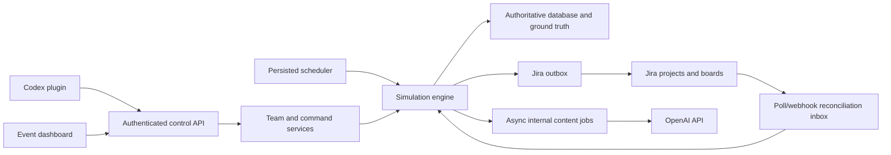

# Jira Team Simulator v2 — High-Level Plan

Status: approved direction; implementation not started.

This is the active product and architecture plan. It intentionally leaves implementation details
to the implementing model and records only the constraints needed to preserve product intent.

## Product outcome

Build an autonomous simulator that creates realistic Scrum and Kanban teams, operates their work in
real time, projects activity into Jira, and retains internal ground truth for testing Jira plugins
and analytics products. Codex is the main setup and control surface; the first web UI is an
event-log and operational dashboard.

## Confirmed product decisions

- Build v2 additively beside the current implementation so existing behavior remains available
  during development.
- Use one newly created company-managed Jira project and matching board per simulated team.
- Represent virtual people through internal ownership plus `sim_assignee` and `sim_reporter`; do not
  use Jira's real assignee/reporter for simulated handoffs.
- Use configurable team business hours. Work and Kanban service clocks use business time; analytics
  expose both business and calendar time.
- Scrum sprints follow fixed calendar boundaries. Unfinished items carry into the next sprint with
  their progress intact and no automatic carryover penalty.
- Kanban SLA/SLE is simulated internally in business hours; Jira Service Management SLA setup is not
  required.
- Daily transcripts are internal documents available from the dashboard; no Jira comments are
  required for v2.
- After restart, resume from committed state without replaying missed daily work. Reconcile Jira
  before generating new changes.
- Team count is ordinary configuration. Every active team uses the same independent scheduler and
  simulation loop; there is no single-team versus multi-team functional architecture. Five
  heterogeneous teams are an initial UAT/load scenario, not a minimum, maximum, or hard parameter.
  Measure higher configured loads only when operational evidence makes that useful.
- Expose the complete simulation ground truth needed to calibrate and validate analytics.
- Use the server OpenAI API key only for autonomous content generation. User conversation and
  control run through Codex and a private simulator plugin/MCP interface.
- Use sensible versioned starter profiles whenever a request omits configuration; every generated
  value remains visible and editable before team creation.

## Functional requirements

### Team creation

A single confirmed Codex request creates one team definition containing its purpose, methodology,
calendar, Jira names, members, roles, responsibility/capacity profiles, workflow, timing profile,
backlog policy, risk profile, and Scrum or Kanban policy. Creation is previewed, confirmed,
idempotent, and observable while the Jira project and board are provisioned.

### Scrum operation

The simulator maintains a ranked backlog, plans capacity-based sprint scope, starts and completes
sprints at fixed boundaries, advances work through type-appropriate routes, and carries unfinished
work forward unchanged. Team availability, responsibility, capacity, and WIP constrain progress.

### Kanban operation

Kanban uses the same people, work, flow, risk, Jira, and evidence components. It adds continuous
replenishment, emerging items, pull/WIP rules, classes of service, and internal business-hour
SLA/SLE warnings and breaches. Kanban follows the first usable Scrum release.

### Statistical simulation and risks

- Status duration is sampled from a configurable baseline by status, work type, and story points.
- Active touch work is tracked separately from waiting/dwell time so member capacity has a real
  mechanical effect.
- Seeded random decisions are reproducible and their inputs/results are retained as ground truth.
- The first supported outcomes are long stays, carryover, external dependency, cancellation,
  review/QA/PO rejection with rework, and member unavailability.
- Risk likelihood should correlate with meaningful factors such as size, description quality,
  complexity, dependencies, prior rework, and member availability. The exact initial formula and
  starter coefficients are implementation choices kept in versioned configuration.
- Language models may generate realistic text, but they do not decide mechanical outcomes.

### Autonomous operation

A persisted scheduler advances every running team without daily input. A committed tick updates
internal state, activity/ground-truth records, and pending Jira intent atomically. Jira and content
network calls run asynchronously so external outages do not corrupt simulation state. Pause,
resume, and Jira-sync freeze are team-scoped.

### Jira projection and manual intervention

Jira is a convergent projection of committed simulator state and also an accepted source of direct
human changes. Use a durable outbound queue plus an inbound reconciliation path (polling first;
webhooks may reduce latency). Simulator-originated changes must not be mistaken for human edits.

The first supported Jira-side interventions are:

- sprint start, stop/completion, or restart;
- known or unknown cards added to a sprint/board;
- cards removed from a sprint, deleted, or archived;
- story-point, priority, rank, summary, description, or acceptance-criteria changes; and
- cards moved through mapped workflow statuses, including backward moves and external blocking.

Supported human changes are adopted and attributed instead of silently overwritten. Changes to
simulator-owned identifiers or an incompatible project/board/workflow topology create a visible,
smallest-scope conflict and pause only the affected item or team synchronization. On process start,
Jira reconciliation runs before sprint-boundary handling or new outbound delivery so changes made
during downtime win consistently.

### Codex control surface

The private plugin exposes typed operations to preview/create a team, inspect state and events,
start/pause/resume, freeze Jira sync, change supported settings, add/update work, change member
availability, inject supported events, read transcripts/ground truth, and resolve surfaced Jira
conflicts. It exposes no generic SQL, arbitrary Jira payload, or server OpenAI credential.

### Dashboard and evidence

The initial UI provides global and per-team chronological feeds, current Scrum/Kanban state,
members/WIP, risks/dependencies, Jira sync/conflicts, transcripts, and ground-truth drill-down. It
may poll; a rich visual team builder and WebSockets are not MVP requirements.

Ground truth correlates Jira IDs with internal items, status visits, sampled timing, business and
calendar durations, capacity allocation, risk inputs/decisions, content provenance, commands, and
manual interventions. It is queryable/exportable and retained for calibration.

## High-level architecture

Use an additive modular monolith with these boundaries:

Key boundaries:

- **Domain core:** team, member/capacity, work item, workflow visit, Scrum/Kanban policy, risk, and
  business-calendar rules. It has no Jira or OpenAI network calls.
- **Runtime:** one persisted scheduler owner advances teams incrementally and resumes committed
  state after restart.
- **Persistence:** relational current state plus append-only activity and calibration evidence. Use
  SQLite/WAL on the existing EBS volume initially and reconsider only if the target-load test shows
  a real limit.
- **Jira integration:** idempotent provisioning, durable outbound intent, paced delivery, inbound
  observations, and reconciliation/conflict handling.
- **Content:** asynchronous structured generation with deterministic fallback; mechanics never wait
  for it.
- **Control/read layer:** typed authenticated HTTP/MCP operations and dashboard-oriented read
  models.

Reuse the current FastAPI/SQLAlchemy foundation, deployment assets, Jira transport/queue concepts,
business-calendar utilities, and React shell where they are sound. Replace the current production
precomputed-schedule path with persisted incremental v2 execution; do not rewrite unrelated v1
functionality merely for consistency.

## Delivery roadmap

1. **Foundation and Scrum core** — isolate v2, establish persistence/runtime, team blueprints,
   business calendars, statistical status flow, capacity, backlog, and fixed sprint lifecycle.
2. **Jira and Codex alpha** — provision one company-managed Scrum project/board, project live work
   safely, and prove one prompt can preview, create, start, inspect, pause, and resume one team.
3. **Resilience and realism** — add Jira-side intervention reconciliation, required causal risks,
   autonomous content, internal transcripts, restart/outage behavior, and ground truth.
4. **Scrum MVP and configured-load UAT** — add the observation dashboard and run heterogeneous
   configured teams through multiple sprint boundaries, manual Jira edits, restart, and provider
   outages. The initial UAT/load fixture contains five teams but uses no separate code path.
5. **Kanban increment** — add arrival/replenishment, pull/WIP, classes of service, business-hour
   SLA/SLE, Jira/Codex/dashboard parity, and a mixed-team acceptance run.
6. **Scale and hardening** — measure higher configured loads (initially 11–14 teams as a load
   scenario), then harden SQLite/Jira throughput, security, backup/restore, deployment, and
   operations only where evidence requires it.

Each milestone should be implemented test-first in reviewable slices under `AGENTS.md`; the capable
implementing model chooses the detailed schemas, algorithms, and task split unless they would change
a confirmed product decision above.

## MVP acceptance

The first production-capable release is accepted when configured Scrum teams can be created through
Codex, run autonomously through at least two sprint boundaries, converge with Jira after supported
manual edits and a restart/outage, produce no duplicate Jira resources or lost committed work,
retain transcripts and calibration ground truth, and remain understandable/controllable from the
event dashboard. Initial UAT exercises this with five heterogeneous teams as a load fixture only;
team count never changes functional behavior. Kanban and measured higher-load validation follow
that gate.

## Deferred

Rich configuration UI, true cross-team dependency propagation, learned calibration from historical
Jira data, multi-Jira tenancy, high-availability/multi-writer deployment, Jira comments, Jira Service
Management SLAs, and replay of missed downtime work are outside the first release.
