# Jira Team Simulator v2 — Executable Implementation Plan

> **REFERENCE DRAFT — NOT THE ACTIVE PLAN.** Pavel asked to keep planning high level. Use
> [`high-level-plan.md`](high-level-plan.md) and [`/backlog/v2/README.md`](/backlog/v2/README.md);
> create detailed tasks only when beginning a milestone.

Every task below is sized for one implementation context and as many small
RED → GREEN → REFACTOR cycles as that bounded task requires.
All code tasks also require the standard evidence and documentation updates in
`implementation-runbook.md`; those obligations are not repeated in every row.

## Dependency Graph

```mermaid
flowchart LR
    G0["G0: isolated v2 foundation"] --> G1["G1: deterministic autonomous Scrum core"]
    G1 --> G2["G2: outbound Jira convergence"]
    G2 --> G3["G3: Codex-created Scrum alpha"]
    G3 --> G4["G4: risks, content, transcripts"]
    G4 --> G5["G5: observable five-team Scrum MVP"]
    G5 --> G6["G6: Kanban vertical slice"]
    G6 --> G7["G7: scale, hardening, release"]
```

Within a stage, tasks execute in ID order unless the `Depends` field explicitly permits otherwise.
Later-stage work cannot start until the prior stage is in `COMPLETE` after Pavel's UAT, as required
by `/AGENTS.md`.

## Stage 0 — Contract and Execution Foundation

### V2-S0-T01 — Freeze the approved v2 plan

- Depends: approved requirements conversation.
- Inputs: current-state assessment, confirmed decisions, repository rules.
- Outputs: `/docs/v2/`, `/backlog/v2/`, `evidence/v2/V2-S0-T01/README.md`, authority/quarantine
  pointers, and traceability matrix.
- Verification: all explicit requirements map to tasks/evidence; JSON contracts parse; links resolve;
  no implementation behavior is claimed as complete.
- Done: planning artifacts are reviewed, the task is marked complete, and no code was changed.

### V2-S0-T02 — Checkpoint and isolate the implementation worktree

- Depends: `V2-S0-T01` committed or otherwise safely checkpointed by the owner.
- Inputs: `main` at the approved baseline plus all current assessment/plan documentation changes.
- Outputs: clean dedicated worktree/branch `codex/v2-live-simulator`; recorded starting commit; v1
  remains unchanged on `main`.
- Verification: `git status --short --branch` is clean in the v2 worktree and all authoritative plan
  files are present.
- Done/stop: done only with no lost/stashed unowned work. Stop if ownership of any current dirty
  change is unresolved.

### V2-S0-T03 — Verify mandatory skills and reproducible toolchain

- Depends: `V2-S0-T02`.
- Inputs: `/AGENTS.md`, backend/frontend manifests, installed skills.
- Outputs: callable obra/superpowers TDD skill, callable Python clean-code skills, Python 3.12+
  environment, frontend dependencies, documented commands.
- RED/verification: intentionally run the baseline command before repair and record missing-tool or
  dependency failure; after environment setup, test discovery and lint/build commands execute.
- Done/stop: no source workaround for a missing tool. Stop code work if the mandatory TDD skill is
  not installed.

### V2-S0-T04 — Capture baseline and establish evidence harness

- Depends: `V2-S0-T03`.
- Inputs: unchanged v1 source and tests.
- Outputs: `evidence/v2/V2-S0-T04/README.md`, reusable disposable SQLite/Jira-fake test fixtures,
  classified pre-existing failures/warnings, and a read-only inventory of deployed database engine,
  row counts, and authoritative data location.
- RED/verification: run full backend tests, Ruff, frontend tests/build, migration upgrade, and
  `git diff --check` without editing production behavior.
- Done/stop: every failure is either fixed in a separately approved task or recorded as an existing
  blocker; no test is skipped/deleted to create a green baseline.

### V2-S0-T05 — Implement blueprint contracts and starter-catalog resolution

- Depends: `V2-S0-T04`.
- Inputs: TeamBlueprint/Draft schemas, `contracts/starter-catalog.md`, approved naming/defaults.
- Outputs: versioned Pydantic draft/final contracts, immutable catalog loader, canonical normalized
  hash, schema-valid `contracts/examples/scrum-balanced-v1.json`, and pure semantic validator; no
  endpoint or database mutation yet.
- RED: incomplete timing grid, duplicate/missing route step, unknown responsibility/status, invalid
  terminal route, overlapping availability, nonpositive weights, anchor/touch order, capacity range,
  calendar/DST input, naming/key, methodology policy, and unknown catalog version all fail with paths.
  A complete recommended Scrum draft resolves identically across processes, including naming,
  first-start, holiday horizon/extension, seed format, rejection targets and content limits; Kanban
  creation remains feature-disabled before G6.
- Done: Stage 1 can consume one fully resolved blueprint without implicit values or natural-language
  parsing, and catalog/schema snapshots are green.

### V2-S0-T06 — Add the additive v2 feature gate and health shell

- Depends: `V2-S0-T05`.
- Inputs: additive-runtime ADR and existing FastAPI/scheduler wiring.
- Outputs: minimal additive `runtime_version` migration/default (`1` for existing rows), isolated v2
  package boundary, anonymous `/api/v2/health/live`, an internal unmounted readiness evaluator, and
  a complete audit/fix of legacy jobs/selectors so they exclude `runtime_version=2`.
- RED: existing team routes/jobs stay v1; an explicit v2 fixture reaches only the v2 shell; invalid
  runtime version is rejected; public legacy E2E/destructive helpers cannot mutate v2 state.
- Done: v1 regression and migration round-trip pass, no existing team activates on v2, and scoped
  `/health/ready` remains unexposed until `V2-S3-T03`.

### V2-S0-T07 — Restore the SQLite/WAL deployment contract

- Depends: `V2-S0-T06`.
- Inputs: `/data/simulator.db`, one-replica decision, current PostgreSQL Compose conflict.
- Outputs: production/dev Compose and settings using mounted SQLite on EBS, WAL/foreign keys/busy
  timeout, durable file permissions, migration-only schema creation (no production
  `Base.metadata.create_all()`), and startup migration failure as a hard failure.
- RED: production config test initially proves PostgreSQL or missing `/data` mount; persistence test
  proves data survives container/process restart after implementation.
- Done: no production PostgreSQL dependency/volume remains, disposable migration round-trip and
  SQLite `PRAGMA quick_check` pass, v1 suite remains green.

### V2-S0-T08 — Preserve or explicitly clear the deployed-data cutover

- Depends: `V2-S0-T04`, `V2-S0-T07`.
- Inputs: read-only deployed-data inventory and the new SQLite target.
- Outputs: a `NO_DATA_TO_MIGRATE` evidence record when the prior production store is empty, or an
  explicit repeatable PostgreSQL-to-SQLite export/import with table counts, primary-key and selected
  content checksums, backup, and rollback instructions when it is not.
- RED/verification: imported disposable copy initially differs until mappings are complete; compare
  source/target counts/checksums and boot v1 read paths against the copy.
- Done/stop: Gate G0 cannot pass on an unknown data location or silent data loss. Never overwrite the
  source database.

### V2-S0-T09 — Prove the target-tenant Jira topology provisioning path

- Depends: `V2-S0-T03`, `V2-S0-T05`; designated disposable Jira tenant/prefix, Jira-admin
  credentials, and explicit live-mutation authorization.
- Inputs: `OFFICIAL_PROJECT_SCOPED_V1`, canonical issue types/status categories/workflow/transition
  graph, official Jira project/issue-type/workflow/workflow-scheme/board APIs.
- Outputs: a bounded target-tenant spike that creates a disposable company-managed project, creates
  or associates dedicated Story/Bug/Task/Spike/Enabler issue types and their scheme, creates and
  associates the canonical workflow/scheme, creates the board last, and fully reads back the board
  filter/location/column mapping and every transition. Record resource IDs and manual cleanup
  guidance; do not automatically delete them.
- Verification: every canonical status maps exactly once: To Do to the To Do column; Analysis,
  Development, Code Review, QA, PO Review, and Blocked External to In Progress; Done and Cancelled
  to Done. Prove every required forward, rejection-return, block-enter/block-return,
  `BLOCKED_EXTERNAL → DONE`, `BLOCKED_EXTERNAL → CANCELLED`, and ordinary-to-Cancelled edge through
  documented public APIs.
- Done/stop: publish capability/request/read-back evidence without secrets. Stop Gate G0 if the
  target tenant cannot produce the exact topology or board mapping; private Jira endpoints and UI
  automation are not permitted substitutes.

### Gate G0

Evidence required: clean isolated worktree, mandatory skills, recorded baseline/data inventory,
resolved executable Scrum blueprint/catalog, additive v2 routing, SQLite restart persistence,
source-data preservation/no-op proof, successful target-tenant topology/read-back proof, all legacy
regressions green, and Pavel's Stage 0 UAT acceptance.

## Stage 1 — Durable Live Runtime and Scrum Kernel

### V2-S1-T01 — Add isolated blueprint, calendar, policy, and runtime persistence

- Depends: G0.
- Inputs: resolved blueprint model from `V2-S0-T05`, additive-isolation ADR, v1 migrations.
- Outputs: new v2-only blueprint snapshot/version/hash, calendar/policy references, team runtime,
  projection mode, `control_epoch`, cursor/next wake, and ownership lease tables; only the minimum
  discriminator/provisioning references touch the legacy team table.
- RED: immutable snapshot, valid runtime transitions, team isolation, v1 default, and invalid policy/
  projection mode cases.
- Done: disposable v1-data upgrade/downgrade/upgrade passes and unversioned v1 APIs cannot see v2
  runtime rows.

### V2-S1-T02 — Add member responsibility and availability persistence

- Depends: `V2-S1-T01`.
- Inputs: member/responsibility/availability blueprint sections.
- Outputs: v2 member identity, activity proficiency, daily capacity/WIP, non-overlapping configured
  availability intervals, and independently sourced runtime availability overlays that may overlap
  and retain provenance.
- RED: duplicate member/activity, overlap within the configured schedule, invalid fraction/capacity/
  WIP, runtime-overlay composition, and cross-team references.
- Done: the complete recommended team round-trips without altering v1 member rows.

### V2-S1-T03 — Add canonical route and timing-catalog persistence

- Depends: `V2-S1-T01`, `V2-S0-T05`.
- Inputs: resolved routes and fully materialized starter timing grid.
- Outputs: immutable canonical status, typed route-step/activity, timing baseline/version/entry tables.
- RED: duplicate/unknown/exceptional route steps, missing terminal, unresolved/duplicate timing cell,
  and cross-team/version mutation cases.
- Done: every active route cell resolves exactly once and Blocked External is not an ordinary route.

### V2-S1-T04 — Add v2 work, sprint, status-visit, and factor persistence

- Depends: `V2-S1-T02`, `V2-S1-T03`.
- Inputs: work/sprint/visit contracts and immutable quality/complexity factors.
- Outputs: new v2 work item, sprint/scope, visit/open-progress-close, dependency, rank, origin, and
  quality/complexity provenance tables.
- RED: terminal-state, one-active-sprint, one-open-visit, supported points, relative rank, factor
  bounds, and cross-team foreign-key invariants.
- Done: representative Scrum state round-trips and no v2 row leaks through legacy issue/sprint APIs.

### V2-S1-T05 — Add append-only activity and ground-truth ledgers

- Depends: `V2-S1-T04`.
- Inputs: domain-event and ground-truth contracts.
- Outputs: append sequence, transaction sequence, semantic dedup key, nullable pre-team/run envelope,
  split visit sample/progress/close records, and stable insertion-order pagination.
- RED: multiple same-type events at one aggregate version coexist in order; semantic duplicate is a
  no-op/conflict; late occurred-at observation remains pageable; append rows cannot be updated.
- Done: schema/version validation and correction-lineage tests pass.

### V2-S1-T06 — Add command audit and durable idempotency

- Depends: `V2-S1-T01`, `V2-S1-T05`.
- Inputs: HTTP/MCP mutation and audit contracts.
- Outputs: typed agent/domain command rows, actor/scope/input hash/confirmation/result, command status,
  and retention classes (provisioning lifetime; ordinary minimum 24 hours).
- RED: same key/same hash returns stable result; same key/different hash conflicts; cross-team actor
  access and partial command mutation fail.
- Done: command replay never duplicates an accepted mutation.

### V2-S1-T07 — Add Jira outbox/resource maps and atomic unit of work

- Depends: `V2-S1-T05`, `V2-S1-T06`.
- Inputs: Jira outbox/event contracts.
- Outputs: generic typed v2 outbox, prerequisite graph, resource maps, and unit-of-work API that
  commits state/evidence/commands/intents together without network calls.
- RED: injected failure after each write class rolls back all classes; dependency cycles and invalid
  local IDs fail; duplicate intent key is stable.
- Done: atomicity tests prove state/event/command/outbox consistency.

### V2-S1-T08 — Implement exact deterministic RNG substreams

- Depends: `V2-S1-T05`.
- Inputs: canonical final blueprint hash, persisted entity ordinals, root seed, and
  `SEMANTIC_ID_V1`/`HMAC_SHA256_U53_V1` contracts.
- Outputs: fixed-namespace UUIDv5 replay IDs separate from database IDs, RFC-8785/HMAC
  implementation, commit-only natural occurrence sequencing, indexed draws, and typed provenance.
- RED: official canonical-JSON fixtures, fixed digest/U53 golden vectors, NFC seed, byte order,
  independent processing order, cross-process replay, and absence of Python `hash()`/autoincrement IDs.
- Done: independent implementation vectors match and draw records serialize to ground truth.

### V2-S1-T09 — Implement exact bounded quantile and touch samplers

- Depends: `V2-S1-T08`, `V2-S1-T03`.
- Inputs: five ordered anchors, explicit unit draw, bounded touch range.
- Outputs: monotone `log1p` inverse CDF and versioned bounded touch sampler.
- RED: `u=0/.25/.50/.99/1` anchors/endpoints, zero/equal anchors, tiny/large values, non-finite/order
  rejection, and full starter-grid vectors.
- Done: fixed/empirical calibration thresholds pass and v1 sampler remains untouched.

### V2-S1-T10 — Implement dual-clock business-calendar primitives

- Depends: `V2-S1-T01`.
- Inputs: UTC instants, IANA timezone, weekday/work interval, explicit holidays and frozen holiday
  profile/horizon.
- Outputs: business/calendar hours, add-business-hours, next-working-instant, business date/end, and
  local-cadence boundary arithmetic plus idempotent `US_FEDERAL_V1` ten-year horizon extension.
- RED: partial days, weekends, holidays, spring/fall DST, UTC/local round-trip, invalid interval, and
  14-local-day boundary retaining local clock time.
- Done: fixed sprint instants are never altered by ordinary work-calendar calculations.

### V2-S1-T11 — Implement responsibility, proficiency, capacity, and WIP allocation

- Depends: `V2-S1-T02`, `V2-S1-T10`.
- Inputs: member activities/proficiency, availability, labor-hour capacity, WIP, touch demand.
- Outputs: `CAPACITY_ALLOCATOR_V1` visit/member total orders, minimum-active-fraction/cap-overlay
  resolution, deterministic allocator/ledger with labor consumption, proficiency-adjusted touch
  credit, sticky ownership and release.
- RED: ineligible/unavailable work, fraction/proficiency formula, daily/WIP caps, duplicate interval,
  every work/member tie-break, touch-complete within-tick release, and multi-item contention.
- Done: ground truth balances labor and effective credit across restart.

### V2-S1-T12 — Implement persistent status entry and live-flow transaction

- Depends: `V2-S1-T07`, `V2-S1-T09`, `V2-S1-T10`, `V2-S1-T11`.
- Inputs: route/baseline, open visit, bounded interval, allocator and deterministic draws.
- Outputs: `EVENT_TIME_LOOP_V1`, sampled open visit, exact-time progress credits, within-tick labor
  reallocation, queue/touch/dwell clocks, chained close/forward/terminal transitions, activity/
  ground truth, and typed local Jira intents in one transaction except boundary split commits.
- RED: both dwell/touch gates, exact p50/p99 monitor instants and same-instant precedence, zero/short
  chained visits, exact completion timestamps, unused-capacity reallocation, both per-slice loop
  guards, business/calendar components, current-slice rollback with earlier boundary slices durable,
  crash checkpoints, no duplicate credit, and Story/Bug route divergence.
- Done: two issue types traverse deterministically in projection mode `DISABLED` without Jira.

### V2-S1-T13 — Implement Scrum planning policy

- Depends: `V2-S1-T08`, `V2-S1-T12`.
- Inputs: total-ordered carryover/backlog, points, dependency DAG, scheduled availability, capacity
  range, and fixed dates under `SCRUM_PLANNER_V1`.
- Outputs: inclusive discrete draw, raw/effective target, mandatory carryover, deterministic
  dependency-frontier first-fit scope/exclusions, first/next sprint state, and planning evidence.
- RED: carryover below/equal/above target, availability ratio zero/fraction/one, priority/rank/UUID
  ties, dependency cycle/closure, oversized item followed by fitting item, unavailable activity,
  empty/undersized backlog, and Epic exclusion.
- Done: seed replay returns identical scope and evidence.

### V2-S1-T14 — Implement fixed lifecycle, boundary splitting, and unchanged carryover

- Depends: `V2-S1-T10`, `V2-S1-T13`.
- Inputs: active sprint boundaries, interval, current items/visits, original local cadence anchor.
- Outputs: exact-boundary split, idempotent start/end, successor carryover, original-anchor manual
  override/current-window rule, successor-validity/work-started predicates, and long-outage
  one-successor rebase with skipped-window count.
- RED: no autonomous early close; manual early/late close and allowed/disallowed reopen; work only to
  boundary; close once; carryover sample/progress unchanged; no penalty; restart before/after/three
  windows late cannot cascade; manual override does not re-anchor; DST successor retains local time.
- Done: next wake is future and one lifecycle result is recorded for recovery.

### V2-S1-T15 — Implement deterministic backlog replenishment stub

- Depends: `V2-S1-T08`, `V2-S1-T13`.
- Inputs: resolved backlog mix/target/factor policies and seed.
- Outputs: v2 items with deterministic template summary/description/criteria, persistent quality/
  complexity, relative rank and provenance; no OpenAI dependency.
- RED: exact weight boundaries, Fibonacci types, factor bounds, replay, dedup, target depth, isolation.
- Done: an autonomous run cannot exhaust backlog and template content is explicitly marked.

### V2-S1-T16 — Implement scheduler ownership, controls, and restart semantics

- Depends: `V2-S1-T12`, `V2-S1-T14`, `V2-S1-T15`.
- Inputs: persisted runtime/cursor/next wake/control epoch, projection mode, one-writer decision.
- Outputs: auto-resuming scheduler, per-team mutex/lease/CAS fence, pause/resume, bounded interval
  processing, restart preflight seam, no-catch-up cursor advancement, and backpressure state.
- RED: no start call after restart; pause defeats stale commit; two writers fail; ordinary overdue
  intervals create no work/content/events; boundary rebase once; DISABLED mode calls no Jira.
- Done: kill/restart, pause race, and multi-team isolation tests pass.

### V2-S1-T17 — Prove a Jira-free autonomous two-sprint Scrum run

- Depends: `V2-S1-T16`.
- Inputs: at least two heterogeneous resolved blueprints and accelerated simulation clock.
- Outputs: acceptance harness and ground-truth export spanning two fixed boundaries.
- Verification: catalogs, planning, backlog, routes, proficiency/capacity, visits, carryover, restart,
  team isolation, deterministic replay, and no server OpenAI/Jira calls.
- Done: Gate G1 evidence/checksums match and no invariant violation occurs.

### Gate G1

Evidence required: resolved catalogs, exact RNG/quantiles, dual clocks, proficiency/capacity/WIP,
atomic state/evidence/command/outbox, deterministic replay, automatic restart, exact/rebased fixed
boundaries, unchanged carryover, and a Jira-free two-sprint run. Stage moves to UAT, then requires
Pavel acceptance.

## Stage 2 — Outbound Jira Provisioning and Convergence

### V2-S2-T01 — Define typed Jira adapter and capability probe

- Depends: G1.
- Inputs: existing Jira client, company-managed project requirement, designated sandbox settings.
- Outputs: injectable typed adapter, fake adapter, complete-pagination helpers, and read-only
  capability report for project/board/workflow/field/webhook operations.
- RED: pagination above Jira defaults, missing permissions, and unsupported endpoints return complete
  results or structured non-mutating failures.
- Done/stop: fake contract suite passes. Live mutation stops if the service account lacks required
  capabilities; read-only evidence names the missing permission.

### V2-S2-T02 — Implement dependency-aware idempotent outbox writer

- Depends: `V2-S2-T01`.
- Inputs: v2 outbox/resource map from `V2-S1-T07`.
- Outputs: short-transaction claim/lease, network-call-without-session, result transaction, typed
  dispatcher, complete command state machine, dependency/terminal-descendant resolution,
  discovery-before-create, pacing, 429/eight-failure backoff, unknown-outcome reconciliation,
  lease-token/delivery-epoch compare-and-swap, postcondition records, and confirmed retry/supersede/
  rebase propagation.
- RED: child cannot dispatch before parent; lease loss/expiry and late-result CAS; each HTTP/error
  class; retry exhaustion; terminal descendant propagation/recovery; sprint timeout uses two-minute/
  three-scan settlement and never blind-retries zero/multiple results; freeze during an in-flight
  request reaches FROZEN without a next claim; replay is safe; different teams preserve isolation/order.
- Done: crash at every delivery checkpoint recovers without lost/duplicate intent.

### V2-S2-T03 — Provision and validate the company-managed project

- Depends: `V2-S2-T02`.
- Inputs: validated Jira blueprint and capability report.
- Outputs: idempotent `ENSURE_PROJECT`, deterministic collision handling, and exact project
  name/key/type/resource-map read-back rather than first-project selection. Board creation waits
  until the workflow scheme is associated in `V2-S2-T05`.
- RED: first run creates via fake, second discovers unchanged resources, partial failure resumes, key
  collision produces a deterministic previewed suffix rather than hijacking another project.
- Done: fake read-back proves the intended company-managed project exists and is not an unrelated
  same-name/key resource.

### V2-S2-T04 — Ensure virtual fields, contexts, and screens

- Depends: `V2-S2-T03`.
- Inputs: project map and field contract.
- Outputs: global `sim_assignee` and `sim_reporter` discovery/create plus required project contexts/
  screens and actionable conflicts.
- RED: absent permission/context/screen, wrong field type, repeated ensure, and partial failure.
- Done: fields are writable on create/update as required and no standard assignee/reporter mutation
  is generated.

### V2-S2-T05 — Provision and validate issue types, workflow, and board topology

- Depends: `V2-S2-T04`.
- Inputs: `OFFICIAL_PROJECT_SCOPED_V1`, the successful `V2-S0-T09` tenant proof, canonical routes,
  required forward/rework/block-enter/block-return/terminal transitions, and project configuration.
- Outputs: idempotent typed ensures for dedicated standard issue types and their project-associated
  scheme plus applicable screen-scheme read-back; canonical statuses, workflow, transition graph,
  and project-associated workflow scheme; board/filter creation only after those associations; 1:1
  status/column/issue-type maps, transition IDs/required fields, and an activation barrier.
- RED: missing/unmapped/duplicate status, wrong board column, absent forward/backward/block enter/
  return/Done/Cancelled transition, or unexpected required field blocks activation; repeated
  validation is idempotent.
- Done: every ordinary/terminal/rework edge, every ordinary-status ↔ `Blocked External` edge, and
  `Blocked External → Done/Cancelled` are executable; every status/type/column maps exactly once; and
  board read-back matches the proven category mapping.

### V2-S2-T06 — Project issues, typed fields, relative rank, and transitions

- Depends: `V2-S2-T04`, `V2-S2-T05`.
- Inputs: committed work/content/estimate/rank/status/virtual-identity events.
- Outputs: create with initial protected `jira-simulator.item-id` issue property, virtual-field,
  estimate, content, relative-rank, and
  causally chained transition commands/resource maps.
- RED: allowlist payload snapshots forbid actual assignee/reporter, comments, raw fields and raw
  LexoRank; timeout-after-create discovers by the initial issue property; initial status avoids self-transition;
  backward/forward read-back and superseded-child rebase converge.
- Done: fake and optional sandbox lifecycle/field projection converges without duplicate issues.

### V2-S2-T07 — Project dependency-safe sprint lifecycle

- Depends: `V2-S2-T03`, `V2-S2-T06`.
- Inputs: committed planning/start/carryover/completion events.
- Outputs: exact initial `CREATE → ADD → START` and boundary `CREATE_SUCCESSOR → ADD_CARRYOVER +
  ADD_NEWLY_SELECTED_SCOPE → COMPLETE_OLD → START_SUCCESSOR` predecessor graphs, deterministic
  sprint discovery tuple/property, and late Jira ID resolution.
- RED: newly created sprint ID is unavailable at plan time yet all children execute after mapping;
  completion cannot precede carryover membership; successor cannot start before old completion or
  projection of all newly selected backlog scope;
  timeout after Jira sprint creation discovers exactly one and duplicate candidates conflict.
- Done: two sprint boundaries converge in fake Jira with one external sprint per local sprint.

### V2-S2-T08 — Add projection reconciliation, outage recovery, and backpressure

- Depends: `V2-S2-T02`, `V2-S2-T06`, `V2-S2-T07`, `V2-S1-T16`.
- Inputs: expected Jira projection, outbox state, Jira read-back, team control state.
- Outputs: MATCHED/PENDING_DELIVERY/DELIVERY_DIVERGENCE states, unknown-outcome reconciliation, paced
  recovery, pause/sync-freeze behavior, exact depth states/threshold transaction/global fence, and
  high/low-water `PROJECTION_BACKPRESSURED`. Human-origin
  differences are retained as unresolved observations for Stage 4 rather than overwritten.
- RED: 429/outage/backlog drains; threshold below/equal/would-exceed and global fleet scope; terminal
  rows/descendants do not deadlock depth; a paused autonomous engine creates no intents while
  explicit commands remain held; a frozen team delivers none; an
  unexpected human difference is preserved and stops a conflicting stale command; safety limit
  fences new ticks/intents until confirmed recovery; one team's divergence does not block others.
- Done: bounded delivery faults converge or surface a stable divergence with no silent overwrite.

### V2-S2-T09 — Run disposable Jira two-sprint projection acceptance

- Depends: `V2-S2-T08`, sandbox credentials/prefix, explicit live-test authorization.
- Inputs: one disposable v2 Scrum fixture.
- Outputs: company-managed project/board, two sprint read-backs, outage/retry evidence, and cleanup
  instructions (not automatic deletion).
- Verification: project/board/fields/routes, issue transitions, virtual identities, sprint ordering,
  recovery, no comments, and no actual assignee/reporter updates.
- Done/stop: Gate G2 evidence passes. Without designated live credentials/authorization, mark this
  task blocked and do not claim the stage complete.

### Gate G2

Evidence required: complete pagination/capability report, exact company-managed board read-back,
field/screen/transition validation, stable create marker, typed field projection, outbox lease/crash/
replay, two-sprint convergence, no simulator-originated real assignee/reporter changes, no comments,
backpressure recovery, and preservation of an unexpected Jira difference without stale overwrite.
Pavel performs Stage 2 UAT. Full human intervention ingestion follows the Codex alpha in Stage 4.

## Stage 3 — Private Codex Control and First Alpha

### V2-S3-T01 — Implement the non-provisioning team preview service

- Depends: G2, `V2-S0-T05`.
- Inputs: complete structured `TeamBlueprintDraft`, stable request ID/source hash, Jira discovery-only
  key check.
- Outputs: an internal, unmounted application service plus stored preview/audit with an exact
  24-hour token lifetime, warnings, resolved final blueprint/hash, collision-resolved names/key,
  and token; no HTTP route, team, Jira resource, or content job.
- RED: raw prompt and incomplete draft fail; request replay is stable; collision suffix is visible;
  expiration/revalidation works; server OpenAI client is never called.
- Done: “non-provisioning” is proven as zero team/project/simulation/content side effects. The
  authenticated HTTP/MCP surfaces are mounted only by `V2-S3-T07`.

### V2-S3-T02 — Implement idempotent provisioning operation

- Depends: `V2-S3-T01`, `V2-S2-T09`.
- Inputs: confirmed preview and lifetime idempotency key.
- Outputs: an internal, unmounted provisioning application service; resumable saga for local state,
  project/board/configuration, backlog, first sprint, reconciliation, READY status,
  projection-mode activation; and an internal operation-status query service. Authenticated routes
  are mounted by `V2-S3-T06`/`V2-S3-T07` after auth exists.
- RED: crash after every step resumes; duplicate confirmation returns the same operation; changed
  payload/key reuse conflicts; partial failure is diagnosable; no automatic Jira deletion.
- Done: operation status supports safe retry for every step.

### V2-S3-T03 — Add private scoped API and dashboard authentication

- Depends: `V2-S3-T01`.
- Inputs: scope/secret/audit and HTTP session contracts.
- Outputs: `Authorization: Bearer` authentication for 32-byte base64url opaque credentials; only
  SHA-256 token digests plus client kind, actor, scopes, creation/last-use/expiry/revocation metadata
  at rest; offline bootstrap/rotate/revoke commands that reveal a secret once; a 24-hour rotation
  overlap; MCP handoff through `JIRA_SIMULATOR_API_TOKEN`; and scoped `/api/v2/health/ready` exposure.
  Also output same-origin dashboard session creation/logout/CSRF endpoints using a distinct
  dashboard-kind credential, `Secure`/`HttpOnly`/`SameSite=Strict` session cookie, 8-hour idle and
  24-hour absolute expiry, strict Origin validation, and a session-bound CSRF token.
  The T01/T02 services remain unmounted.
- RED: malformed/missing/invalid/expired/revoked/insufficient-scope/wrong-client-kind credentials,
  rotation before/during/after overlap, cross-team access, replayed/absent CSRF, wrong Origin,
  secret log/response/database plaintext, MCP environment omission, and anonymous readiness fail.
- Done: the auth dependencies and credential lifecycle are reusable by every later route; only
  liveness, credential-authenticated session creation, logout/session helpers, and authenticated
  readiness are mounted at this task.

### V2-S3-T04 — Establish minimum trusted TLS and isolate legacy public helpers

- Depends: `V2-S3-T03`.
- Inputs: Nginx/deployment, private DNS/certificate prerequisite, v1/v2 route inventory.
- Outputs: trusted HTTPS, HTTP redirect/closure policy, secure secret injection, and disabled or
  separately guarded public v1 E2E/destructive helpers.
- RED: plaintext credential/control request, untrusted certificate, accidental public helper, and
  secret-in-config/evidence cases.
- Done/stop: remote Codex alpha cannot proceed without trusted TLS; loopback-only tests do not satisfy
  G3.

### V2-S3-T05 — Scaffold the private Codex skill, plugin, and thin MCP server

- Depends: `V2-S3-T04`.
- Inputs: draft schema, starter catalog, MCP contract, official plugin/skill manifest requirements.
- Outputs: valid plugin manifest, simulator skill that converts conversation/approved defaults into a
  complete draft, thin authenticated MCP client/server configuration consuming
  `JIRA_SIMULATOR_API_TOKEN` from the deployment secret environment, and health check. Use the
  repository-approved plugin/skill creation workflow during implementation.
- RED: manifest/draft fixtures fail before scaffold; afterward plugin loads and authenticated health/
  list succeeds.
- Done: plugin contains no simulator mechanics, Jira credentials, or server OpenAI key; the API
  receives no raw prompt.

### V2-S3-T06 — Implement basic MCP read tools

- Depends: `V2-S3-T03`, `V2-S3-T05`.
- Inputs: persisted operation/team/runtime/activity state and HTTP/MCP contracts.
- Outputs: authenticated operation/team-list/team-state/activity HTTP routes plus `get_operation`,
  `list_teams`, `get_team_state`, and `get_activity` MCP tools only.
- RED: HTTP and MCP schema snapshots, append-sequence pagination, team isolation, missing/unauthorized
  cases, and read-only behavior.
- Done: tools return stable concise data and never mutate; transcript/full ground-truth tools remain
  unregistered until their backing stages.

### V2-S3-T07 — Implement MCP preview and confirmed creation

- Depends: `V2-S3-T02`, `V2-S3-T05`.
- Inputs: structured draft preview and provisioning APIs.
- Outputs: authenticated preview/create HTTP routes plus contract tests and `preview_team`,
  `create_team`, and `get_operation` MCP integration.
- RED: raw prompt, missing confirmation/scope/lifetime idempotency, timeout/repeat, and changed-hash
  reuse cases.
- Done: one confirmed preview maps to one operation/team/project.

### V2-S3-T08 — Implement MCP start, pause, and resume controls

- Depends: `V2-S3-T05`, `V2-S1-T16`.
- Inputs: persisted lifecycle state and control epoch.
- Outputs: authenticated start/pause/resume HTTP routes and matching MCP tools.
- RED: invalid state/scope/idempotency and pause-versus-in-flight-tick race.
- Done: returned pause proves no old-epoch tick can commit.

### V2-S3-T09 — Implement MCP Jira sync controls

- Depends: `V2-S3-T05`, `V2-S2-T08`.
- Inputs: sync-freeze/backpressure state.
- Outputs: authenticated sync-freeze/unfreeze/state HTTP routes, matching MCP tools, and safe
  backpressure state read.
- RED: team isolation; immediate freeze with no lease; `FREEZING` during a delivery lease; matching,
  expired, and late call results; no next claim; unsafe clear above low-water mark; and retries.
- Done: controls reflect committed state and never discard outbox rows.

### V2-S3-T10 — Implement versioned team-settings control

- Depends: `V2-S3-T05`, `V2-S1-T01`.
- Inputs: typed calendar/capacity/backlog/future-cadence fields and expected version; content/risk
  policy is not accepted at G3.
- Outputs: authenticated versioned settings HTTP route and `update_team_settings` MCP tool with
  immutable active sprint boundaries.
- RED: stale version, active-boundary/topology/current-work mutation, arbitrary patch, and valid
  future policy.
- Done: current mechanics remain valid and every change is audited.

### V2-S3-T11 — Implement work-item controls

- Depends: `V2-S3-T05`, `V2-S2-T06`.
- Inputs: typed work-item mutations and relative-rank model.
- Outputs: authenticated add/update HTTP routes and matching MCP tools for allowlisted content/
  estimate/priority/rank and supported future placement.
- RED: arbitrary status/Jira field, unsupported points, raw LexoRank, stale version, team leak, and
  typed Jira projection.
- Done: controls cannot bypass transition/risk mechanics.

### V2-S3-T12 — Implement member-availability control

- Depends: `V2-S3-T05`, `V2-S1-T11`.
- Inputs: typed interval/fraction/capacity mutation.
- Outputs: authenticated availability HTTP route, `set_member_availability` MCP tool, and audit.
- RED: overlapping independently sourced runtime restrictions compose by the most restrictive
  fraction/cap; invalid bounds/fraction/capacity increase, cross-team member, duplicate key, and
  current allocation release behavior.
- Done: future allocation reflects the committed availability version.

### V2-S3-T13 — Prove prompt-to-running-team Codex alpha

- Depends: `V2-S3-T06`–`V2-S3-T12`.
- Inputs: one representative user prompt and approved disposable Jira preview/authorization.
- Outputs: Codex conversation-to-draft transcript, preview/confirmation, operation trace, running
  Scrum team, authenticated API/MCP state/activity, and Jira read-back.
- Done: one prompt creates exactly one team/project, starts, reads, controls, and repeats idempotently;
  preview/control produces zero server OpenAI calls. Pavel performs Stage 3 UAT.

### Gate G3 — First usable alpha

Basic autonomous statistical Scrum and private TLS Codex control are usable without the rich risk,
content, intervention, or UI increments. Evidence includes the full conversation → structured draft
→ preview → confirmation → Jira → running-team path plus HTTP/MCP contract parity for every G3 tool.

## Stage 4 — Jira Intervention, Causal Risks, Internal Content, and Transcripts

### V2-S4-T01 — Add durable verified Jira webhook intake

- Depends: G3, `V2-S2-T02`, `V2-S3-T04`.
- Inputs: trusted callback route, webhook secret configuration, raw provider envelope contract.
- Outputs: inbox/raw-hash migration and a callback that verifies raw UTF-8 HMAC
  `X-Hub-Signature`, persists a valid delivery in a short transaction, then acknowledges; no live
  registration occurs until this storage path is green.
- RED: invalid/missing signature writes nothing; duplicate raw delivery is stable; crash before/
  after persist; old/new rotation overlap; malformed/oversized payload; secret/log leakage.
- Done/stop: a valid callback is durable before response and a live Jira registration cannot yet
  target a non-durable handler.

### V2-S4-T02 — Register webhooks and normalize/deduplicate Jira interventions

- Depends: `V2-S4-T01`, `V2-S2-T01`.
- Inputs: durable verified callback, Jira admin capability, poll-derived deltas, delivered commands/
  postconditions.
- Outputs: idempotent admin registration/read-back/secret rotation for issue/sprint events, local
  managed-resource filtering, normalization states `RECEIVED → NORMALIZED → READY → APPLIED` plus
  terminal states, delivery/semantic dedup, actor/source, and strict echo evidence.
- RED: duplicate registration; unmanaged sprint; plaintext/untrusted URL; missing capability;
  duplicate webhook+poll applies once; same actor alone is not echo; exact own write is echo;
  reordered observations deterministic; malformed observation isolates safely.
- Done: verified live registration targets the durable handler, every observation is pending-ready
  or terminal with append-only evidence, and polling remains mandatory fallback.

### V2-S4-T03 — Adopt manual sprint topology and scope membership

- Depends: `V2-S4-T02`, `V2-S2-T07`, `V2-S1-T14`.
- Inputs: one coherent board/sprint snapshot covering start/complete/reopen and membership changes.
- Outputs: observed boundary override, one active successor, carryover, scope/forecast changes,
  original-anchor current-window successor, remove/re-add preservation, capacity release, and
  lifecycle-conflict isolation.
- RED: valid early/late completion and restart apply once without cadence re-anchor; successor is
  sole valid active; exact successor-work-started predicate; impossible reopened/
  two-active topology pauses lifecycle only; remove then re-add preserves visit/progress; fixed end is
  unchanged for ordinary scope changes.
- Done: supported topology converges and evidence names actor/observation/result.

### V2-S4-T04 — Import unknown Jira cards with explicit defaults

- Depends: `V2-S4-T02`, `V2-S1-T04`, `V2-S2-T06`.
- Inputs: unknown managed-board/sprint issue and team's versioned import defaults.
- Outputs: `origin=JIRA_MANUAL`, Jira author, mapped type/status/points, Task/3 fallback provenance,
  deterministic factors, resource map, and item-only quarantine for unmappable data.
- RED: complete metadata, missing metadata, unsupported status/type/points, replay, and another-team
  project issue.
- Done: imported item is visible and mechanically safe without rewriting the Jira source.

### V2-S4-T05 — Adopt manual estimate, priority, relative rank, and content changes

- Depends: `V2-S4-T02`, `V2-S2-T06`, `V2-S1-T13`.
- Inputs: points/priority/Jira rank/summary/description/acceptance-criteria observations.
- Outputs: remaining-work-only scaling, `NO_RATIO_BASELINE`, relative managed-item ordering,
  human-content provenance, next-plan effect, and unchanged existing quality/complexity factors.
- RED: completed-work preservation, old missing/zero, unsupported new points item quarantine, Jira
  rank rebalance no-op, true relative move, next planning order, human real assignee/reporter
  preservation, and content-factor stability.
- Done: supported edits survive future ticks/outbox and are never stale-overwritten.

### V2-S4-T06 — Adopt manual status, terminal, blocking, deletion, and archive changes

- Depends: `V2-S4-T02`, `V2-S1-T12`, `V2-S2-T06`.
- Inputs: mapped/unmapped status and delete/archive observations.
- Outputs: attributed close/new visit, skipped/backward provenance, exceptional block overlay,
  terminal capacity release, tombstone, and item quarantine.
- RED: forward/skip/backward; Blocked External preserves suspended sample; Blocked External to
  Done/Cancelled closes the episode and suspended visit once; terminal capacity release; move out
  of terminal is quarantined; unmapped status isolates item; deleted item is never recreated.
- Done: valid transitions converge and invalid/deleted state remains visible/stable.

### V2-S4-T07 — Detect protected-field and protected-topology conflicts

- Depends: `V2-S4-T02`, `V2-S2-T03`–`V2-S2-T06`.
- Inputs: virtual/provenance field, project, board, workflow, status scheme, screen/context observations.
- Outputs: smallest-scope protected conflict, item quarantine or team sync freeze, server-enumerated
  resolution choices, and no auto-recreate/remap.
- RED: every protected resource type, isolated item versus team effect, other-team continuation, and
  actual Jira assignee/reporter human-value preservation.
- Done: no protected divergence is silently overwritten.

### V2-S4-T08 — Complete poll snapshots, startup intervention drain, and stale supersession

- Depends: `V2-S4-T03`–`V2-S4-T07`, `V2-S1-T16`.
- Inputs: persisted per-resource snapshots/high-water marks, inbox/outbox/runtime versions.
- Outputs: paginated poll deltas, webhook-loss recovery, restart poll-and-apply barrier before
  lifecycle/outbox, intervention processing while paused with zero time credit, and stale command/
  descendant supersede or rebase.
- RED: lost webhook, downtime sprint completion, paused team intervention, stale parent/descendants,
  startup Jira unavailable (`RECONCILIATION_PENDING` fences one team), pagination above 50, replay,
  and unrelated-team progress.
- Done: restart/manual changes converge before autonomous recovery can contradict them.

### V2-S4-T09 — Implement confirmed Jira-conflict resolution

- Depends: `V2-S4-T07`, `V2-S4-T08`, `V2-S3-T03`.
- Inputs: conflict and only server-generated restore/adopt/quarantine choices.
- Outputs: authenticated admin API, idempotent resolution command, correction lineage, corrective
  typed outbox intent/read-back, and conflict closure.
- RED: detect → enumerate → missing/valid confirmation → restore/adopt → read-back → repeat; arbitrary
  payload and stale choice fail.
- Done: resolution is explicit, attributable, reversible through history, and cannot mutate another
  resource.

### V2-S4-T10 — Persist versioned risk policies and evaluation triggers

- Depends: G3, `V2-S0-T05`, `V2-S1-T04`.
- Inputs: resolved starter profile, persistent work-item factors, trigger/occurrence-key matrix.
- Outputs: immutable profile/coefficients/normalizers/clamps/duration policies, enabled set, and
  exact workday/visit trigger snapshot and precedence table, rejection map/rework cap/formula, and
  content instructions; long stay/carryover remain monitors rather than hazards.
- RED: unknown/missing coefficient/trigger, base outside `(0,1)`, clamp/order/bounds, stable factors,
  profile immutability, and imported-item provenance.
- Done: no implementation-time risk value remains implicit.

### V2-S4-T11 — Implement versioned causal probability engine

- Depends: `V2-S4-T10`, `V2-S1-T08`.
- Inputs: enabled base, normalized factors, coefficients/clamp, semantic occurrence and draw.
- Outputs: pure stable logistic calculation and `RISK_EVALUATED` record.
- RED: numerical extremes, disabled risk, invalid zero/one base, clamp, exact fixed vectors, replay,
  and deterministic monotonic adverse-factor grids.
- Done: no LLM participates and every result is explainable.

### V2-S4-T12 — Implement status-aging and carryover monitors

- Depends: `V2-S4-T11`, `V2-S1-T14`.
- Inputs: visit baseline/business dwell and sprint result.
- Outputs: one p50 `STATUS_STAY_WARNING`, one configured-default-p99 `LONG_STAY_DETECTED`, and causal
  carryover record without added work.
- RED: exact thresholds/replay, calendar time alone cannot trigger, carryover only at fixed/accepted
  boundary, and no penalty/outcome-flag injection.
- Done: activity, transcript source, and ground truth agree.

### V2-S4-T13 — Implement synthetic external dependency episodes

- Depends: `V2-S4-T11`, `V2-S1-T12`.
- Inputs: natural decision or authenticated causal command, item, duration policy.
- Outputs: exceptional block overlay, paused normal visit, released worker, blocked durations, resolve/
  resume without resampling, and persisted simulation-business-time remainder that freezes over
  pause/restart downtime.
- RED: no ordinary aging/work while blocked; capacity reuse; exact remaining timer/sample/progress
  through restart; manual open-ended/early resolve; natural and forced occurrence sequences
  independent; duplicate start/resolve stable.
- Done: local/Jira projection/evidence converge without comments.

### V2-S4-T14 — Implement cancellation and review/QA/PO rejection

- Depends: `V2-S4-T11`, `V2-S1-T12`.
- Inputs: route/review visit and natural/forced decision.
- Outputs: terminal cancellation or allowed move-left with new visit and bounded explicit rework.
- RED: no post-cancel work; capacity release; earlier configured target; loop cap; skipped/provenance;
  deterministic rework draw and Jira transition.
- Done: mechanics, projection, activity, and ground truth match.

### V2-S4-T15 — Implement member unavailability

- Depends: `V2-S4-T11`, `V2-S1-T11`.
- Inputs: member/business-date natural decision or authenticated interval command.
- Outputs: independent availability overlay, zero/bounded capacity, ownership release/reassignment,
  return event, and persisted scheduled-business-time remainder.
- RED: absent member no work; others continue; repeated command stable; natural 1–3 labor-day
  duration decrements only newly processed scheduled business time (including a partial-day
  remainder); overlapping explicit/natural restrictions compose; simulation duration freezes across
  pause/restart; human absolute interval applies only current resume truth; return has no catch-up;
  unavailable factor affects later eligible risks.
- Done: capacity ledger and risk evidence reconcile.

### V2-S4-T16 — Add risk-policy and causal-event APIs

- Depends: `V2-S4-T12`–`V2-S4-T15`, `V2-S3-T03`.
- Inputs: constrained HTTP schemas and durable commands.
- Outputs: authenticated risk-policy update and causal commands for dwell extension, dependency,
  cancellation, review rejection, and unavailability with exact target/version/effective-time bounds.
- RED: every min/max edge; past and over-30-day effective time; due-during-restart/pause persists and
  applies once after reconciliation/resume with lateness/no backfill; stale target; direct long-stay/
  carryover flag; cross-team/bulk/
  unsupported target; unsafe duration/policy; duplicate key; and unrelated RNG perturbation fail.
- Done: supported causes can induce scenarios while derived outcomes remain honest.

### V2-S4-T17 — Implement structured OpenAI content jobs, safe backfill, and fallback

- Depends: `V2-S4-T10`, `V2-S2-T06`.
- Inputs: committed mechanics, server API config, versioned schemas/templates and template backlog.
- Outputs: versioned content-policy persistence and authenticated HTTP update route; async backlog/
  criteria/sprint-goal/event jobs; five-job claim limit; 45-second timeout; one retry;
  1,200-output-token default; validation/usage/provenance; deterministic fallback; and typed Jira
  content updates. Backfill only nonterminal template-sourced items; never overwrite human-edited
  content.
- RED: exact defaults/overrides/provenance, timeout/malformed/rate limit/missing key, idempotency,
  human edit race, server-key secrecy, and mechanics continuing during failure.
- Done: content/fallback is consistent with fixed quality/complexity and cannot choose mechanics.

### V2-S4-T18 — Implement internal daily transcript documents

- Depends: `V2-S4-T08`, `V2-S4-T12`–`V2-S4-T17`.
- Inputs: one team's committed events when a running tick processes that working date's end boundary.
- Outputs: exactly one internal document for an eligible day, source references, authenticated API
  read, and fallback.
- RED: normal day; restart before/after commit; duplicate tick; nonworking date; missed-downtime day
  creates none; no other-team/uncommitted fact; no Jira command/comment.
- Done: each eligible processed workday has one dashboard-ready transcript and provenance.

### V2-S4-T19 — Add deferred MCP content, risk, transcript, and Jira-conflict tools

- Depends: `V2-S4-T09`, `V2-S4-T16`, `V2-S4-T18`, `V2-S3-T05`.
- Inputs: completed backing APIs and eventual MCP contract.
- Outputs: `update_content_policy`, `inject_event`, `update_risk_policy`, `get_transcript`, and confirmed
  `reconcile_jira_conflict` tools.
- RED: scope/schema/idempotency/confirmation, missing resource, and proof no generic raw mutation.
- Done: every registered tool has a backing API and audit correlation.

### V2-S4-T20 — Prove manual-intervention and named-risk scenarios

- Depends: `V2-S4-T19`.
- Inputs: disposable live Jira intervention script, forced-cause scenarios, and seeded cohort harness.
- Outputs: direct evidence for every `R-JIRA-004` branch and all required risk outcomes/causal
  directions, including event identity/actor/times/before-after/decision/version/outbox lineage.
- Done: webhook and lost-webhook poll paths, detect-confirm-restore/adopt-readback-repeat, mechanics,
  Jira, transcripts, activity, and ground truth agree; Pavel performs Stage 4 UAT.

### Gate G4

All supported Jira human interventions are adopted or safely isolated. Required risks are
mechanically real and statistically explainable; four hazards plus bounded dwell extension are
agent-controlled causes, while long stay/carryover remain derived outcomes. Internal narration is
resilient to content-service failure.

## Stage 5 — Observation Dashboard and Scrum MVP Release

### V2-S5-T01 — Build paginated read models

- Depends: G4.
- Inputs: authoritative state, activity, ground truth, transcript, Jira sync/intervention records.
- Outputs: global/team feed, team summary, current work, sync/conflict, transcript, and drill-down APIs.
- RED: stable cursor ordering, filters, large-page boundaries, authorization, team isolation, snapshot
  consistency.
- Done: UI needs no direct Jira calls or client-side truth reconstruction.

### V2-S5-T02 — Implement authenticated ground-truth query and export

- Depends: `V2-S5-T01`.
- Inputs: append-only ground truth/corrections and Jira resource maps.
- Outputs: team-scoped filters including Jira key, stable append-sequence pagination, asynchronous
  deterministic ZIP export containing `manifest.json` and append-ordered `ground-truth.ndjson`,
  authenticated metadata/status and streaming download routes, schema/algorithm manifest,
  per-entry/archive SHA-256 checksums, correction lineage, private `/data/exports` storage, and
  24-hour artifact expiry without deleting source ground-truth rows or export metadata.
- RED: authorization/team leak, late observation pagination, Jira-key lookup, large stream, stable
  replay checksum, correction reference, export retry/idempotency, and retention inventory.
- Done: a scoped client can create, poll, download, and checksum-verify a complete export without a
  database/raw-path/public-link escape.

### V2-S5-T03 — Add deferred MCP ground-truth query/export

- Depends: `V2-S5-T02`, `V2-S3-T05`.
- Inputs: authenticated query/export/operation/metadata/download APIs.
- Outputs: `get_ground_truth` query/export behavior, export metadata polling, and an authenticated
  `simulator-export://ground-truth/<team_id>/<export_id>` MCP resource whose server-side API client
  exposes a constrained resource template/read and streams the ZIP without exposing an HTTP bearer,
  raw file path, or public signed URL.
- RED: scope/team isolation, mutually incompatible filters, pagination, operation polling, HTTP
  download/checksum, MCP resource download/checksum, expiry, and no raw file/database path.
- Done: both direct HTTP and MCP consumers retrieve and verify the complete backend export contract.

### V2-S5-T04 — Rework shell into global/team observation navigation

- Depends: `V2-S5-T01`.
- Inputs: reusable React shell/team selector and new read contracts.
- Outputs: global view, team view, clear runtime/sync state, minimal links to legacy configuration.
- RED: credential form/session establishment, no bearer persisted in browser storage, CSRF-protected
  logout/mutations, expiry/revocation, default route, and no-team/one-team/multi-team/loading/error
  states.
- Done: configuration-heavy screens are no longer the primary workflow.

### V2-S5-T05 — Implement chronological event/risk/Jira/intervention feed

- Depends: `V2-S5-T04`.
- Inputs: activity feed API.
- Outputs: polling feed with filters, pagination, timestamps, actors, causes, Jira links, retry/conflict
  state, and accessible event detail.
- RED: global/team isolation, pagination without duplicates, live refresh, failure/retry and human
  intervention cards.
- Done: every MVP scenario is observable in chronological order.

### V2-S5-T06 — Implement policy and current-work summary

- Depends: `V2-S5-T04`.
- Inputs: team summary/current work APIs.
- Outputs: sprint boundary/scope/carryover or Kanban placeholder, member availability/WIP, current
  statuses/risks, next wake and Jira health.
- RED: paused/restarting/conflicted/empty states and stale-data label.
- Done: an operator can understand what is running and why an item is waiting.

### V2-S5-T07 — Implement transcript and ground-truth drill-down

- Depends: `V2-S5-T02`, `V2-S5-T05`.
- Inputs: transcript and ground-truth APIs.
- Outputs: transcript index/detail, source-event links, sample/risk causality panel, export initiation.
- RED: access control, missing/fallback transcript, calibration fields, Jira-key lookup.
- Done: no transcript publish/comment action exists.

### V2-S5-T08 — Implement persisted emergency controls and conflict actions

- Depends: `V2-S5-T06`, `V2-S4-T09`.
- Inputs: pause/resume/sync-freeze APIs and server-provided reconciliation options.
- Outputs: explicit confirmation where required, idempotency, pending/success/error feedback.
- RED: controls show only after authorization; pause cannot falsely show success; arbitrary conflict
  payload is impossible.
- Done: UI state reflects committed server result.

### V2-S5-T09 — Browser, accessibility, and responsive acceptance

- Depends: `V2-S5-T05`–`V2-S5-T08`.
- Inputs: representative five-team fixtures and all failure/manual-intervention states.
- Outputs: browser E2E, keyboard/semantic checks, desktop/mobile screenshots.
- Done: dashboard observes every Scrum MVP acceptance scenario.

### V2-S5-T10 — Harden the private Scrum MVP surface

- Depends: `V2-S5-T09`.
- Inputs: private-auth contract, Nginx/deployment, current v1/v2 route inventory.
- Outputs: re-audited TLS, secret rotation/revocation drill, authorization/tool/route inventory,
  API/MCP credential issuance and dashboard session/CSRF drill, HTTP/MCP Scrum-control parity
  report, disabled/guarded public E2E/destructive helpers, safe logs/errors and webhook-secret
  rotation.
- RED: anonymous mutation, scope escalation, secret leakage, insecure TLS and accidental public v1
  helper access.
- Done: every externally reachable route has an explicit access decision and the Scrum MVP is not
  deployed over plaintext.

### V2-S5-T11 — Prove Scrum MVP backup, restore, migration, and rollback

- Depends: `V2-S5-T10`.
- Inputs: production-like SQLite containing v1/v2 state, outbox/inbox work, transcripts and ground
  truth.
- Outputs: SQLite-safe backup, disposable restore/integrity/migration proof, application rollback
  preserving v2 data and Jira resources.
- RED/verification: restore while delivery is disabled, compare state/event/queue checksums, boot and
  resume without catch-up/duplicates.
- Done: an operator can recover the five-team release without overwriting the source database.

### V2-S5-T12 — Add Scrum MVP metrics and run fault matrix

- Depends: `V2-S5-T11`.
- Inputs: runtime/DB/outbox/inbox/content/API states and restart/Jira/OpenAI/manual-conflict faults.
- Outputs: structured metrics, bounded alerts, and deterministic fault-injection report.
- RED: database lock, tick crash, 429/5xx/timeout, lost/duplicate webhook, OpenAI outage, and manual
  conflict each produce expected isolation/recovery evidence without secret leakage.
- Done: soak thresholds are measurable and no state/evidence/outbox split or duplicate Jira effect
  remains.

### V2-S5-T13 — Run and release the five-team Scrum MVP

- Depends: `V2-S5-T12`, designated Jira sandbox, five approved project previews.
- Inputs: five heterogeneous Scrum teams, two sprint boundaries, restart/outage/content failure, all
  supported risks and Jira manual interventions.
- Outputs: accelerated semantic-time live-Jira boundary report with wall-clock Jira pacing, a
  separate 60-minute real-time smoke of at least 12 ordinary ticks per team, resource/latency/lock/
  queue/convergence/calibration report, Jira read-backs, release manifest, deployment/rollback/docs.
- Done: the five-team Scrum thresholds in `verification-matrix.md` pass with zero invariant violation
  or unresolved divergence, every supported Scrum operator action has typed HTTP/MCP parity,
  CI/deployment/backup are green, and Pavel accepts Stage 5 UAT.

### Gate G5 — Scrum MVP release

The dashboard is sufficient to operate/diagnose the system, the hardened five-team live Scrum soak
passes, the complete Scrum control surface has typed HTTP/MCP parity, and Pavel accepts the first
production-capable Scrum release. Kanban begins only afterward.

## Stage 6 — Kanban Vertical Slice

### V2-S6-T01 — Activate and complete the Kanban blueprint/policy branch

- Depends: G5.
- Inputs: forward-declared but creation-disabled TeamBlueprint branch and immutable
  `KANBAN_BALANCED_V1`.
- Outputs: class priority/weights, status/blocked WIP, all three arrival-policy branches,
  start/pause/stop/warning/target semantic validation, schema-valid canonical Kanban fixture,
  migrations, and confirmed-creation feature activation.
- RED: arrival kind/parameter mismatch, nonpositive total class weight, duplicate class priority,
  invalid class/status/limit/clock references, missing capacity-status limit, and Scrum regression.
- Done: a complete Kanban blueprint has no sprint dependency.

### V2-S6-T02 — Implement continuous replenishment and emerging work

- Depends: `V2-S6-T01`.
- Inputs: exact shifted-exponential/on-demand/scheduled-batch rules, backlog policy, agent/Jira manual
  additions.
- Outputs: persisted/frozen simulation timer, reproducible arrivals/suppression, explicit emerging-item
  provenance, and continuous backlog maintenance.
- RED: exponential endpoints/cap, business-only advance, pause/restart no catch-up, scheduled missed
  batch, backlog-full no-burst suppression, same-seed replay, manual import, and target depth.
- Done: Kanban operates indefinitely without sprint rows.

### V2-S6-T03 — Implement pull and status/member WIP enforcement

- Depends: `V2-S6-T02`, `V2-S1-T11`, `V2-S1-T12`.
- Inputs: exact class/item total order, status/blocked WIP, member WIP/capacity.
- Outputs: deterministic pull selection and status/member WIP evidence.
- RED: every class/priority/rank/UUID tie; never exceed limits; expedite has no bypass; blocked item
  releases member capacity but counts against suspended-status WIP; no push into full destination.
- Done: WIP invariants survive restart and manual Jira status moves.

### V2-S6-T04 — Implement business-hour SLA/SLE clocks

- Depends: `V2-S6-T03`, `V2-S1-T10`.
- Inputs: exact `KANBAN_BALANCED_V1` class policy and status transitions/pause reasons.
- Outputs: start/pause/resume/warning/breach/stop state and ground truth.
- RED: every class, nights/weekends/holidays, dependency pauses, exact warning/target boundaries,
  manual skipped-start/direct-stop states, restart/no catch-up, and one-shot events.
- Done: business and calendar durations are both queryable; no Jira SLA configuration call exists.

### V2-S6-T05 — Provision and project a company-managed Kanban board

- Depends: `V2-S6-T01`, G2, G4.
- Inputs: confirmed Kanban blueprint and Jira capability report.
- Outputs: idempotent company-managed project/board, issue/status projection, intervention handling.
- RED: board type/filter/read-back, repeated bootstrap, no sprint commands for Kanban.
- Done: live/fake Kanban Jira state converges through multiple SLA windows.

### V2-S6-T06 — Add Kanban Codex and dashboard surfaces

- Depends: `V2-S6-T04`, `V2-S6-T05`.
- Inputs: existing MCP/read/UI components.
- Outputs: preview/create/state/activity/inject controls and WIP/SLA dashboard views.
- RED: methodology-specific schemas, breach/manual-intervention feed, no Scrum assumptions.
- Done: one Codex request creates and operates a Kanban team without configuration UI.

### V2-S6-T07 — Prove mixed Scrum/Kanban autonomy

- Depends: `V2-S6-T06`.
- Inputs: three Scrum and two Kanban fixtures, restart, Jira outage, manual interventions.
- Outputs: mixed-team soak evidence and ground-truth exports.
- Done: team isolation, WIP/SLA/sprint invariants, Jira convergence, and restart pass; Pavel performs
  Stage 6 UAT.

### Gate G6

Kanban runs autonomously with business-hour SLA/SLE and shares the proven control, risk, Jira,
intervention, dashboard, and calibration infrastructure.

## Stage 7 — Mixed-Team Scale, Hardening, and Release

### V2-S7-T01 — Re-audit mixed-method security and API surface

- Depends: G6.
- Inputs: Gate G5 security evidence plus all new Kanban routes/tools/views.
- Outputs: updated scope/route/tool inventory, negative auth tests and deployment surface report.
- RED: any Kanban read/control route missing the established auth/secret/TLS protections.
- Done: the complete mixed-method surface preserves the G5 controls.

### V2-S7-T02 — Prove mixed-policy backup, restore, and restart

- Depends: `V2-S7-T01`.
- Inputs: G5 procedure plus active Scrum/Kanban service clocks, queued/inbox work and transcripts.
- Outputs: updated restore/restart evidence across both policy types.
- Done: restored mixed teams resume committed state/SLA clocks without catch-up or duplicate Jira work.

### V2-S7-T03 — Finalize mixed-team metrics and storage projections

- Depends: `V2-S7-T01`.
- Inputs: G5 metrics plus Kanban WIP/SLA/arrival states.
- Outputs: mixed-policy dashboards and measured start/end database/WAL/export bytes. Compute
  per-team-business-day growth from the 20-day soak, then project the next 90 calendar days using
  each team's configured count of working dates. Use
  `fixed_end_bytes + variable_rate * projected_team_business_days * 1.25`; report peak WAL separately.
- RED: WIP/SLA breach/recovery and mixed scheduler lag are measurable without team leakage.
- Done: all target-soak thresholds can be measured from retained artifacts.

### V2-S7-T04 — Run fault-injection recovery matrix

- Depends: `V2-S7-T02`, `V2-S7-T03`.
- Inputs: crash points, DB lock contention, Jira 429/5xx/timeout, lost/duplicate webhooks, OpenAI
  outage, manual conflicts.
- Outputs: deterministic failure report and fixes.
- Done: no state/evidence/outbox split, no duplicate external effect, other teams continue, all
  terminal conflicts visible.

### V2-S7-T05 — Run five-team live Scrum/Kanban soak

- Depends: `V2-S7-T04`, designated Jira sandbox and approved five project previews.
- Inputs: exactly three heterogeneous Scrum and two Kanban teams, at least two sprint boundaries for
  Scrum and five SLA target windows for Kanban, scheduled restarts/interventions/outages.
- Outputs: resource/latency/queue/lock/convergence/calibration report and Jira read-backs.
- Done: all thresholds in `verification-matrix.md` pass with zero invariant violation or unresolved
  divergence.

### V2-S7-T06 — Run 14-team fake-Jira target soak

- Depends: `V2-S7-T05`.
- Inputs: 14 heterogeneous teams, production-class hardware profile, fake Jira enforcing pacing,
  rate limits, manual observations, and failures.
- Outputs: 20-business-day accelerated report, database integrity, storage projection.
- Done: threshold pass proves architectural headroom; it does not authorize creating 14 live Jira
  projects.

### V2-S7-T07 — Make evidence-based SQLite/PostgreSQL decision

- Depends: `V2-S7-T06`.
- Inputs: lock, tick, API, queue, integrity and resource results.
- Outputs: accepted gate record retaining SQLite, or a proposed PostgreSQL ADR/backlog blocked for
  Pavel approval.
- Done/stop: retain SQLite when thresholds pass. Do not migrate automatically when they fail.

### V2-S7-T08 — Release documentation, deployment, and UAT

- Depends: `V2-S7-T07`.
- Inputs: all gates/evidence, current deployment/restore procedures, known limitations.
- Outputs: current-state README, operator runbook, calibration export guide, plugin install guide,
  release manifest, deployed five-team release, UAT checklist.
- Done: CI is green, deployment/health/backup/Jira/Codex/dashboard checks pass, and Pavel signs off.

### Gate G7

The mixed-method release is complete only after every requirement in `verification-matrix.md` has
direct current evidence, the G7 five-team mixed live regression passes, the 14-team target test is
reviewed, and Pavel records UAT acceptance. Live expansion above five teams is a separate approval.
